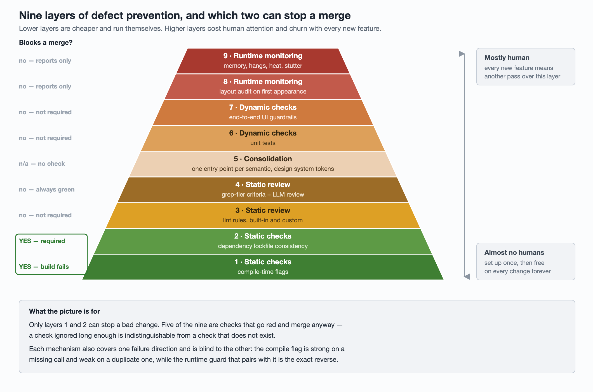

# Nine layers of defect prevention in an iOS client

A climbing harness is not what stops you falling. It is what makes a fall
survivable, and it earns its place by being three things at once: reliable, so
you never think about it; flexible, so it does not stop you climbing; and
lightweight, so you keep wearing it. A quality harness around a codebase is held
to the same three standards, and most of the ways one fails are failures of the
second and third rather than the first.

What follows is an audit of one iOS client's harness: nine layers, what each one
catches expressed as a user-visible symptom, and — the question that turns out to
matter most — whether it can actually block a merge or merely report.

Lower layers are cheaper and more automatic. Higher ones cost more human
attention and churn with every new feature. That ordering is also, roughly, the
order in which they stop working when nobody is looking.

## The ladder at a glance

| # | Layer | Catches (as the user sees it) | Blocks a merge? | Biggest gap |
| --- | --- | --- | --- | --- |
| 9 | Runtime · memory & hangs | OOM kills, freezes, heat, stutter | No — after-the-fact signal | No automatic alert |
| 8 | Runtime · layout | Truncated text, controls off screen | No — traps internally, non-fatal in production | Coverage on high-traffic screens near zero |
| 7 | Dynamic · UI guardrails | Dead taps, entry points duplicated or missing, iPad multi-column mis-layout | No — not on the required list | No decision on making it required |
| 6 | Dynamic · unit tests | Compile breaks, logic regressions | No — the job is not required | Slow single runner |
| 5 | Structural · consolidation | The same defect reappearing at a new call site | No — it removes the wrong way, it does not check | No reusable component for "call this exactly once" |
| 4 | Static review · AI review | New files in the legacy language, new coupling to a god object, colors outside the design system | No — the job is always green; the bot reviews, never approves | Its criteria cannot carry a gate |
| 3 | Static review · lint | Values silently degrading to empty strings, dead taps with zero logs, layout regressions | Reports but does not block — two PRs merged over a red one | False-positive rate not established |
| 2 | Static check · lockfile consistency | Every PR in the repo failing to build | Yes — the only required check | Renaming the job silently changes the required list |
| 1 | Static check · compile-time flag | Push notifications delivered unmodified; extension process killed | Yes — the build fails | Enabled on one target only |

Two of nine layers can stop a bad change. That number is the single most useful
output of the whole audit, and it is not visible from any individual layer.

## 1 — Compile-time flags

A notification service extension gets a `contentHandler` and one rule: call it
exactly once. Miss it or call it twice and the push still arrives — carrying the
original, unmodified payload. No image attachment, no text trimmed to the render
width. The extension process may be killed, and that crash does not reach your
crash reporter, because the reporter was initialized in the app delegate and the
extension is a different process that never linked it. Production signal: zero.

Clang's `-Wcompletion-handler` is the cheapest guard available against this.
Measured against three shapes:

| Shape | Caught |
| --- | --- |
| Early return without calling the handler | yes |
| Two calls in the same function | yes |
| Handler stored in a property, called from two methods | **no** |

So it is strong protection against a *missing* call and covers only the half of
the *duplicate* case you would have caught in review anyway — and the shape it
misses is the one that actually shipped. (The full treatment of that particular
bug, including the runtime guard that complements this flag, is in
[the notification service extension article](../../notification/crashes/content-handler-call-count.md).)

Turning it on repo-wide is usually not the move. A full build of 1271
translation units surfaced 34 pre-existing hits, of which none were defects that
could reach a user. Rewriting 34 working call sites to enable a flag is a bad
trade, so the permanent gate went on the one target whose count was already
zero, and the rest are tracked by diffing periodic audits.

Three things to know before you trust it:

- **Order the flags.** Write `-Werror=unknown-warning-option
  -Werror=completion-handler`. The first is not about your code; it is about the
  toolchain removing the guard underneath you. If the warning group is renamed
  or dropped, an unknown option is silently ignored and the gate stops existing.
- **A working flag and an ignored flag produce identical build logs.** Both say
  "succeeded, no diagnostics". Verification needs a positive control: inject a
  defect and confirm the build now fails.
- **When you diff two audits, the key is file + diagnostic + the guard on that
  source line, never the line number.** Line numbers move for reasons that have
  nothing to do with the defect.

## 2 — Lockfile consistency

The most disruptive failure in this list is also the dullest. A stale dependency
lockfile lands on the trunk, and from that moment every PR in the repo fails
before it reaches the tests. One such incident cost the whole team 3 h 11 min.

There was already a gate for this, and it did not catch it. It validated the
lockfile's checksum of the *evaluated dependency specs* and never looked at the
checksum of the *manifest source file*. Having a gate is not the same as that
gate covering this failure. When you post-mortem a miss, read the list of steps
the job actually ran; the job's name tells you nothing.

The trigger is always the same: merging the trunk into a branch when that merge
touches the dependency manifest. The manifest merges cleanly as a union; the
lockfile's manifest-checksum line necessarily conflicts, and someone resolves it
by picking a side. **A derived value has no correct side to pick.** The only
correct resolution is to re-run the dependency install after the merge.

The rewritten check validates both checksums, runs on a hosted Linux box with no
install step, and is the only required check on the trunk. It has since caught
the same mistake pre-merge: fixed in 4 min 10 s, re-run, merged, nothing leaked.

Its own gap is structural: on most CI platforms the job's name *is* the required
context name. Rename the job and you have silently edited the required list.

## 3 — Lint rules: the layer that reports and does not block

This layer targets three classes of defect that had all shipped before:

- a field value silently degrading to an empty string — an empty image id
  concatenated into a URL that is guaranteed to 404, while the card still
  reserves the full image height,
- a tap that does nothing and logs nothing,
- text truncation and controls escaping the screen.

The setup is 22 built-in rules plus 9 custom ones, each custom rule written
after a production incident, linting only the `.swift` files the PR changed.
Custom rules at error level do genuinely fail the check — verified by hand and
by a real PR.

And it does not block anything, because it is not on the required list. On a
single day two PRs merged over a red lint check, and one of them carried a real
defect through: an empty string winning a nil-coalesce and degrading a cache key.

### What it takes to promote a reporting check to a blocking one

Five criteria, four of which this check passed: 60 runs with zero environment
flakes, cannot be skipped, only ever blames the author of the change, and a
median runtime of 385 s. The one it failed is the one that matters:

> You may not gate on a signal you cannot confirm is true.

The main rule measured an 8.8% false-positive rate. That was fixed — but 1219
remaining hits are still unqualified, so the current false-positive rate is
unknown. Gating on a noisy check does not produce careful engineers; it produces
engineers who have learned that this check is noise.

### Three traps in maintaining a suppression baseline

1. **Fewer baseline entries is not proof of progress.** It equally means the
   rule stopped matching. And a 4 MB single-line JSON baseline makes a 3-entry
   change and a 9527-entry change produce visually identical diffs.
2. **Changing a rule's message invalidates every baseline entry for that rule.**
   Measured: unsuppressed violations went from 6 to 1225 on a message edit
   alone. The baseline has to be regenerated on the runner, at the same commit.
3. **When the comparison tooling breaks, its report is byte-identical to "the
   two match."** That needs its own self-check, or the day it breaks looks
   exactly like the day everything is fine.

Remaining gaps: 324 files in the legacy language carry zero rules, including
core files on the startup path; changes to the linter's exclusion list are
reviewed by nobody; and upgrading the linter on the runner triggers no job at
all, so the runner and local machines drifted several minor versions apart.

## 4 — Automated review, and why it cannot hold a gate

The useful framing for an AI review layer is: freeze the part of review comments
that a machine can restate. Here that is three deterministic, zero-LLM criteria —
new files in the legacy language, net-new call sites coupling to a god-object
singleton, and colors, icons or fonts bypassing the design system tokens — plus
one LLM review pass. It runs on every open, reopen and push, with one round in
flight per PR; a force-push cancels the round it superseded.

Two boundaries are worth stating because they are easy to assume away:

- **The deterministic job is always green.** All three tiers only write a report
  file; none of them ever exits non-zero. The job can only go red if its own
  tooling is missing. Nothing can be gated here. The output is a PR comment.
- **The bot reviews, it does not approve.** It sits on the repository's approve
  denylist, so a human approval is still required to merge.

One more thing that bites: a review job reading the platform's own PR diff sees
merge-base semantics. It is blind to trunk drift after the branch forked, which
is precisely the class of problem layer 2 exists for.

## 5 — Consolidation: making the wrong way unwritable

Layers 1 through 4 all share a shape: you write it wrong, and something tells
you afterwards. This layer does no checking at all. It gives each semantic
exactly one entry point, so the wrong way stops being something you can express.

It sits between layers 4 and 6 on the cost axis deliberately. Designing the
consolidation is human work, but every PR afterwards is free — cheaper than
maintaining tests, more expensive than a static check, and it needs a fresh pass
each time a new semantic appears.

The worked example is the call-exactly-once handler from layer 1. The shipped
form routes every delivery path through one function guarded by an atomic
test-and-set. The more thorough form puts "only once" into the type: a
once-wrapper that releases the wrapped block after the first call, making the
second a no-op rather than a crash. That component does not exist in this
codebase yet — a repo-wide grep returns nothing. It is on the list, not done.

Two things about this layer are easy to read wrong.

**A once-wrapper prevents duplicates and does nothing about omissions.** "At most
once" and "at least once" are separate guarantees needing separate mechanisms,
and conflating them is how you end up believing you are covered.

**The obvious detector for omissions does not work everywhere.** Asserting in
`dealloc` that a handler was used is a fine technique in the app process. In a
notification extension it fails twice over: a missed call is masked by the
system's own timeout fallback, and `dealloc` never runs when the process is
killed. Build the consumer of a signal before you build the reporter.

The discipline that keeps this layer from decaying: **every consolidation must be
pinned by a lint rule at layer 3**, or call site N+1 quietly appears. Two of the
nine custom rules exist for exactly that reason.

Semantics consolidated so far:

| Semantic | Consolidated into | In use | Pinned by |
| --- | --- | --- | --- |
| Missing string fields arriving as empty strings | A non-empty-string wrapper type | 20 files | lint rule |
| Force unwraps and force casts | A safe-unwrap helper | 65 files | nothing — review only |
| Failing to open content must be reported | A perform-or-report helper | 26 files | lint rule |
| The several spellings of a comment anchor id | One params type + one action factory | 4 files each | two lint rules |
| Colors, icons, fonts | Design system tokens | 171 files | AI review tier 3 |
| Extension handler called once | A single delivery exit | 1 site | compile flag (same-function only) |

The "pinned by" column is the point of the table. One row is pinned by nothing,
and that is the row where the next regression will come from.

## 6 — Unit tests, and the 18.9% that are not your fault

This layer catches compile breaks and logic regressions. It also fails 18.9% of
the time for reasons unrelated to the change under test, and a check that goes
red for reasons unrelated to you has exactly one teaching effect: press re-run.

**Count by attempt, not by run.** Over one month: 365 non-cancelled attempts, 69
failures. Nine of those runs passed on re-run, so their run-level conclusion is
`success` — counting by run understates the failure rate by 13%.

Sampling 29 failures by hand gave the real breakdown: 8 were the lockfile gate
working exactly as intended, 2 were compile failures, 19 were test failures.
Classifying the 23 failing tests inside those 19 by *root cause* — not by error
message, because one cause surfaces as several different messages — put 16 of 23
(70%) in a single bucket: waiting a fixed duration and timing out.

The most expensive single shape is worth naming precisely:

> A polling wait helper that returns when its deadline passes without asserting
> anything.

The test then continues against state that has not converged, and the failure
lands on the *next* assertion — where it reads, in CI, like a business logic
defect. The rule of thumb that falls out: when you see a failed assertion, check
whether a polling wait precedes it before you read the business logic at all.

What fixing this looked like: change detection moved to merge-base semantics (42
files down to 6 in one measurement), test parallelism turned off, wait-helper
timeouts converted into assertion failures at 50 call sites plus two pump
helpers, deallocation assertions converted to polling at 115 sites, and every
dependence on a fixed wait duration removed.

Still open: the runner's intermittent slowdowns have no proven cause, the hosted
CI path still runs tests in parallel, and 91 implicit-unwrap sites on one
singleton chain are untouched.

## 7 — End-to-end guardrails for the regressions nothing else sees

Three real regressions motivate this layer, and they have a family resemblance:
nothing crashes, the logs are clean, and no unit test can see them.

- iPad multi-column feed laying out wrong,
- a share entry in comments appearing twice or not at all, because experiments
  move it between the cell and the overflow menu,
- the feed's overflow menu doing nothing on tap.

These only reproduce when something taps a real surface. So: three independent
workflows, one UI smoke test each, on a self-hosted macOS runner pool, 45-minute
timeout.

**Do not filter these by changed paths.** A path filter is equivalent to a skip,
and a required check that is skipped never reports at all — the PR waits forever
for a result that will not arrive. Instead every job runs on every PR and begins
with a detect step; unrelated PRs short-circuit in seconds. Measured on one PR:
the relevant guardrail ran a full iPad smoke in 9 min 41 s, while the other two
detected irrelevance and exited in 17 s and 12 s.

The division of labour is worth copying: anything that can be pinned in a unit
test stays in the unit tests — layout truth tables, the in-cell half of the entry
point test — and the guardrail covers only the end-to-end half.

Gaps: none of the three is required, so a red one can still be merged past. And
the detect step has no positive control, which means "detect says this PR is
irrelevant" and "detect is broken" are currently indistinguishable.

## 8 — Auditing layout at runtime

Some adaptation defects compile, run, produce not one Auto Layout conflict log,
and pass CI entirely green. The originating case: a screen whose five rows were
all pinned at 64 pt, whose subtitle was compressed to zero height, with 7 of 10
labels truncated — and zero conflict log lines across three devices. The only
detection channel was user feedback.

The mechanism is a bounded traversal on each view controller's first appearance:
a 300-node budget, an 8 ms hard deadline, hopping to the next runloop turn. It
reports on five criteria — ambiguous layout, vertically truncated label,
horizontally truncated single-line label, a control lying entirely outside the
audited view, and a label overflowing its immediate superview. Findings go out as
non-fatals; internal builds trap on the spot; it ships behind a flag that is
still off by default.

The verification is the part worth stealing:

- **Positive control, end to end.** Force the audit on, revert a constraint
  priority to reintroduce a known defect, and confirm the app traps the moment
  the screen appears.
- **Negative control.** The same screens after the fix produce no findings.
- **Mutation test.** Force one probe to return constant false and confirm that
  exactly the cases that should go red do go red.

### Read the denominator before you read the numbers

Four independent reasons the coverage is smaller than it looks:

- hidden subtrees are skipped entirely, and at least one screen constructs its
  target view hidden,
- a one-shot audit at first appearance never sees a cell scrolled in later,
- on data-driven screens the text arrives after the network response, i.e. after
  the audit ran,
- the 8 ms cut-off is timing-dependent, so two passes over the same screen can
  disagree.

Coverage on the highest-traffic screens is therefore close to zero, and "these
screens are clean" is not a conclusion this tool can support.

One more honest note on capability. The one real defect it caught was a label
overflowing 9.33 pt on each side in a longer locale — and it caught it by luck.
The rule matched "wrappable label with a fixed height"; the actual defect was
that the label had no width constraint at all. Right line, wrong reason. When
this rolls out, a low finding count must not be read as low harm.

## 9 — Memory and hangs from the field

The top layer does not prevent anything. It is the production signal for four
symptoms that are otherwise invisible: memory-driven kills, freeze crashes, heat
and battery drain, and stutter. Note that when users say "laggy" they mostly mean
a main-thread hang, not dropped scroll frames — so a scroll-hitch metric does not
cover the complaint.

Three daily events carry it: a system-provided daily metrics payload (hang count,
hang milliseconds, hangs over 2 s, CPU seconds, foreground and background
seconds, background CPU limit), a previous-exit record on every cold start, and a
storage breakdown.

Three measurement rules that each cost real time to learn:

1. **Attribute by the metric window's end, not by event time.** The 24-hour
   window closes at device-local midnight and delivery is frequently delayed
   across days — in one morning's events, 41.1% carried the previous day's window.
2. **Do not route this through your product-analytics SDK.** The system delivery
   callback fires whenever the process is alive, background wakes included.
   Measured, that counted 72,000 devices per day that never opened the app into
   DAU.
3. **Changing the channel changes the delivery semantics.** The in-house pipe
   used here is a 20-item memory buffer, persisted to disk only after an upload
   failure, flushed only on resign-active. That is a different reliability
   contract than the SDK's, and dashboards built on one do not transfer.

The most expensive methodological lesson sits inside point 2. Those 72,000
devices land on a 3.4 M DAU base: 2.1%, comfortably inside ±3% of normal daily
variation. Neither day-over-day nor same-weekday week-over-week movement shows it
at all. **A blunt measure does not return "unknown"; it returns a confident wrong
answer.**

One category remains undiagnosable with what exists today: heat. Three real
sources of waste were found and fixed, and not one of them was ever causally
linked to a heat complaint. The order that keeps this honest is: count the
feedback volume first, read the platform's own device metrics second, and only
then decide whether new instrumentation is justified.

Gaps: there is no automatic alert yet — the planned one hangs off a "DAU minus
app-open gap exceeds 3.5%" chart. The on-device payload simulation has never
been run, so the whole pipeline has zero runtime evidence behind it. And the beta
channel carries 1–2 devices per build, which is not an acceptance signal.

## What the audit actually produced

Writing it all down in one table produced three findings that no individual
layer's owner could have seen.

**Only two of nine layers can block a merge**, and five of the nine are checks
that report and cannot stop anything. A check that goes red and is ignored long
enough is indistinguishable from a check that does not exist. The unresolved
decision — whether layers 3, 6 and 7 join the required list — is worth more than
any further engineering on those layers, and it is a repository-permissions
decision, not an engineering one.

**Each mechanism covers one failure direction and is blind to the other.** The
compile flag is strong on missing calls and weak on duplicates; the runtime
guard is the exact reverse. Writing coverage down *per direction* is what stops
you shipping one guard and believing you are finished.

**Almost every verification here has a state where clean and broken look
identical.** A silently ignored compiler flag, a comparison script that failed,
a detect step that always says "irrelevant", a filtered-out required check, a
review job that only ever writes files — each of them reports success. The
discipline that separates them is the same every time: inject the defect, run the
exact command you intend to trust, and confirm it goes red.
