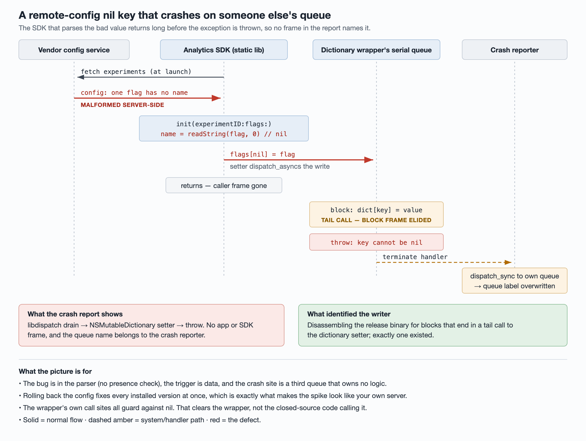

# A nil-key crash with no app frames: tracing a remote-config spike to a statically linked SDK

For about two and a half hours one morning, an iOS app crashed roughly 600,000
times — about once per affected user — with a single signature:

```
-[__NSDictionaryM setObject:forKeyedSubscript:]: key cannot be nil
```

Crash-free users dropped by almost ten points. Then it stopped, on every build
at the same minute, without anyone shipping anything. The report contained no
frame from the app or from any SDK. This article is about how the writer was
found anyway, the one wrong turn that cost most of a day, and the two
diagnostic signals that would have made it a one-hour job.



**Root cause, confirmed:** Firebase Analytics (GoogleAppMeasurement) fetches SDK
experiment configuration from Google's `sdk-exp` endpoint. For a few hours
Google served a malformed config in which an experiment flag had no name
field. The SDK parsed the missing name as `nil` and used it as a dictionary
key; the write was dispatched onto a wrapper dictionary's private serial
queue, and the exception was thrown there. Google rolled the config back and
every build recovered at once — no client release was involved.

## 1. What the data said before anyone looked at code

| Observation | What it implies |
| --- | --- |
| Every installed build started and stopped crashing within the same minutes, including builds several years old | The trigger is data delivered from a server, not code in any one build |
| The stop was a cliff back to baseline, not a decay | The data was withdrawn or fixed server-side |
| iOS only; the Android app was flat through the same window | Either only the iOS client failed to handle the data, or it was only sent to iOS |
| About one crash per user | The data is read once per launch, and the crash happens before it is cached |
| ~18% of crashes happened in the background | Launches include background wakes, e.g. push-triggered |
| No correlation with push opens, ad errors, or any first-party A/B arm | The trigger is not a feature path you control |

Hourly counts (UTC), fatal crashes only:

| Hour | iOS, this signature | Android, all fatal crashes |
| --- | ---: | ---: |
| 22:00 (day before) | 2 | 520 |
| 23:00 | 4 | 564 |
| 00:00 | 12,808 | 722 |
| 01:00 | 347,503 | 759 |
| 02:00 | 232,416 | 556 |
| 03:00 | 101 | 632 |
| 04:00 | 36 | 520 |

Exporting the raw events to the warehouse gave a sharper edge than the
console: 99.93% of all occurrences that month fell between 00:00 and 03:00 UTC,
and only 9 of those were before 00:30. The warehouse and the console disagreed
by a few percent on the total — different counting rules, same conclusion.

### The oldest build is a filter

The crash appeared on builds from years back. Whatever code was responsible had
therefore been in the app for years, which immediately rules out every
component integrated since then. That cut the candidate list to a handful of
long-lived SDKs — ads, analytics, attribution, bug reporting — plus the app's
own early Objective-C code.

A side effect worth knowing: the crash reporter split this single crash into
several issues — one where the OS version lacked system symbols, another where
libdispatch was picked as the "owning" library. When several issues spike in
the same window with the same exception text, check whether they are one.

## 2. Why the stack names no one

```
_pthread_wqthread → _dispatch_workloop_worker_thread
  → _dispatch_lane_serial_drain          background serial queue
  → _dispatch_call_block_and_release     a block from dispatch_async
  → -[__NSDictionaryM setObject:forKeyedSubscript:]
  → objc_exception_throw → (crash reporter's terminate handler)
```

Two things erased the evidence:

1. **Tail call.** The block's last statement was `dict[key] = value`. The
   compiler emits that as a branch, not a call, so the block's own frame is
   gone and the setter appears to be called directly by libdispatch. The code
   that computed the nil key returned even earlier — it only enqueued the block.
2. **Queue label overwritten.** The crash reporter handles the exception by
   `dispatch_sync`-ing onto its own queue, so the "queue" field in the report
   shows the crash reporter's label, not the queue that threw.

The queue label is the missing piece: whoever creates a serial queue names it,
and a name like `com.vendor.something.queue` identifies the owner at a glance.

## 3. Hypotheses, and how each was closed

| Hypothesis | Method and evidence | Verdict |
| --- | --- | --- |
| A change in the build under release testing | Its crashes fell inside the same window; old builds without the change crashed identically | Ruled out |
| Beta auto-update / distribution SDK | App Store builds don't use it; its blocks target the main queue, the crash is on a background serial queue | Ruled out |
| Automated device-farm testing | Those fresh-install crashes were part of the same wave | Ruled out |
| Push open path | Only a third of crashes had a push event — push woke many users and amplified launches, it was not the common path | Ruled out as cause |
| Ad bidding failures | Ad errors appeared in a minority of crash breadcrumbs; the specific retry path in under 0.1% | Ruled out |
| The app's own Objective-C | Only a few files use `dispatch_async`, all onto the main queue; the one private serial queue is in Swift, which cannot pass a nil key to this setter | Mostly ruled out |
| Open-source pods | The GoogleUtilities wrapper matched the tail-call shape exactly, but all its own write sites check for nil — so it was cleared. **This was wrong**, see §5 | Was the cause |
| An own endpoint returning `{}` | Simulator + intercepting proxy, emptying each of ~15 endpoints hit on cold launch, with and without cache, breakpoint on `objc_exception_throw`. Positive controls: breakpoint hits, traffic goes through the proxy, TLS decrypts, rule applies | Ruled out for `{}` only |
| Ad-platform config endpoints | `{}`, empty body, and recursive removal of identifier fields, each on a cold launch — all clean. Also too new to exist in the old builds | Ruled out |
| Missing inner fields, empty body, HTTP 500 on own endpoints | Not tested | Unverified |
| A first-party A/B arm | Arms were ~50/50 among crashed users; the few near-100% arms were equally near-100% among unrelated crashes — they are full-traffic | Ruled out |
| Some SDK thread busy at crash time | Compared the queues and libraries on *other* threads in target vs. unrelated crashes. No SDK enriched; only an audio framework was higher, consistent with "woken by push, playing media" | No signal |
| Third-party binary SDKs (disassembly) | Scanned 30 vendor binaries for blocks ending in a tail call to `setObject:forKeyedSubscript:`; see §4 | Ruled out (current versions) |
| A bidding SDK whose queue was conspicuously absent | Rationale in §4. Disassembled its blocks: several end in a tail call, none to this selector | Ruled out |
| A server/config change in the window | Start and stop line up with a working-hours change and a rollback; only iOS affected | Open, then confirmed |
| A third-party SDK's own remote config | The dynamic-framework scan missed it because the SDK is a **static library linked into the main binary**; scanning the release app binary found it | **Confirmed** |

## 4. The technique that found it: scan binaries for the crash's shape

The stack gives you the shape of the code even when it hides the name: *a block,
run from a serial queue, whose last instruction is a tail branch to the
dictionary setter.* You can search compiled code for that shape.

For each candidate binary:

1. `objdump -d -r` it.
2. Find every `*_block_invoke` that ends in `b _objc_msgSend` (older toolchains)
   or `b _objc_msgSend$<selector>` (selector stubs, newer toolchains).
3. For the old style, resolve which selector was loaded by following the
   relocation into `__objc_selrefs`.
4. Keep only blocks whose final message is `setObject:forKeyedSubscript:`.

**Run a positive control first.** Compile
`dispatch_async(q, ^{ d[k] = v; })` at `-O2` and confirm the script flags it.
Without that, a scanner that matches nothing and a clean binary look identical.

In the vendor frameworks this found a few helpers ending in the setter — each
checked the key first — and some outlined functions reached by `bl`, which keeps
the caller's frame and therefore can't produce this stack. Nothing matched.

**Then scan the app binary itself.** That is where the answer was. Static
libraries don't ship as separate frameworks; they are linked into the main
executable, so a scan of `Frameworks/` never sees them. Across the entire
release binary exactly one block had the crash's shape:
`-[GULMutableDictionary setObject:forKeyedSubscript:]_block_invoke`.

### Corroborating with other threads

A serial queue runs on one thread at a time, so while it is throwing on the
crashing thread it cannot appear on any other. That gives two usable tests
across hundreds of thousands of reports:

- The suspect queue should be *rarer* on non-crashing threads than in unrelated
  crashes. The wrapper's queue was 11× rarer. (This logic had earlier been used
  to suspect a bidding SDK whose queue was completely absent — it turned out
  absent only because the crash happened before that SDK started.)
- The producer should be *busy*. In 99.999% of target crashes another thread was
  inside the SDK's experiment fetch —
  `fetchExperiments → handleFetchingExperimentsResponse → Snapshot initWithProtobuf → Experiment copyWithZone:` —
  against 76% in unrelated crashes.

### Reading the caller

Only one closed-source module used the wrapper: the analytics SDK's
experiment/remote-config code. Its `-[APMEExperiment initWithExperimentID:flags:]`
iterates the delivered flags, reads each name with a protobuf string getter,
and writes `_flags[name] = flag` — with no presence check on the field and no
nil check on the result. `_flags` is the `GULMutableDictionary`.

## 5. The wrong turn

The wrapper was cleared early because every write site *inside GoogleUtilities*
guards against nil. That proves GoogleUtilities never passes nil itself. It says
nothing about callers, and the caller was in a closed-source binary that the
source-level review could not see. "The library's own call sites are safe" and
"the library cannot receive bad input" are different claims; only the first was
checked.

## 6. External confirmation

A cluster of issues opened on firebase-ios-sdk in the same window (for example
[#16728](https://github.com/firebase/firebase-ios-sdk/issues/16728),
[#16734](https://github.com/firebase/firebase-ios-sdk/issues/16734),
[#16737](https://github.com/firebase/firebase-ios-sdk/issues/16737)). The
maintainers attributed it to a malformed `sdk-exp` config, fixed by a
server-side rollback with no client update required. GoogleUtilities merged
[PR #249](https://github.com/google/GoogleUtilities/pull/249), which makes
`GULMutableDictionary` ignore a nil key instead of crashing.

Timing caveat: the issues cite roughly 00:41–02:47 UTC; the app's own data puts
the bulk at 00:30–03:00 UTC. The maintainers' "fully resolved" notice came
about four hours after the crashes had actually stopped — don't use an
announcement time as the mitigation time.

## 7. What to do

**Upgrade GoogleUtilities** to a release containing PR #249 once it ships. It is
the only change that protects future builds from the next malformed payload of
this kind. Older installed builds stay exposed regardless.

**Add the queue label to crash reports.** Install an Objective-C exception
preprocessor with `objc_setExceptionPreprocessor`. It runs inside
`objc_exception_throw`, still on the throwing queue — earlier than any terminate
handler. On a nil-insertion exception, write `dispatch_queue_get_label` into a
crash-reporter custom key, then chain to the previous preprocessor.

- Don't modify the exception. Rewriting its reason adds your frame to the
  stack, and the crash reporter will regroup every such crash under your code.
- Check that the custom-key setter persists synchronously; if it does, the value
  reaches disk before the process dies.
- Skip it when the throwing queue is the crash reporter's own, or the sync write
  deadlocks.
- A prototype on macOS confirmed the hook sees the real label before
  termination.

**Make experiment exposure readable in crash reports.** An existing custom key
held the user's experiment list as a Swift `Array.description` — newlines,
indentation, quotes — and every one of ~26,000 sampled values was truncated at
the 1,024-character limit. Sort and comma-join instead, split across a small
fixed set of keys, and clear the unused ones so values from an earlier session
don't linger.

**Hold the global swizzle in reserve.** Swizzling `__NSDictionaryM`'s setters to
drop nil keys and log a non-fatal (with queue label, value class and call stack)
would both stop the bleeding and name the writer. It was not needed once the
culprit was known, and it has real costs: it patches a private class cluster,
some code may rely on the exception, and it only protects new builds. If you
ever ship it, ship it behind a remote kill switch, default off, ramped
gradually.

**When the next spike looks server-shaped, ask about the window first.** Collect
every deploy, config change and rollback from your own teams in the window, and
check vendor status pages and issue trackers for the same hours. The test is
whether a change's start and stop match the spike's edges and affect only one
platform. A proxy-based local repro — strip inner fields from candidate
responses, cold-launch, break on `objc_exception_throw`, run `thread info` for
the queue name — is the slower confirmation.

## References

- [firebase-ios-sdk #16728](https://github.com/firebase/firebase-ios-sdk/issues/16728) — one of the incident reports and the maintainers' explanation.
- [GoogleUtilities PR #249](https://github.com/google/GoogleUtilities/pull/249) — nil-key tolerance in `GULMutableDictionary`.
- [`objc_setExceptionPreprocessor`](https://github.com/apple-oss-distributions/objc4/blob/main/runtime/objc-exception.h) — declared in the Objective-C runtime's exception header.
