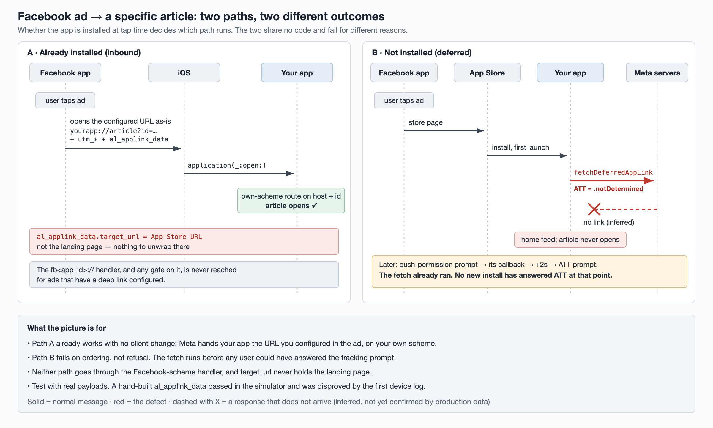

# Facebook Ads Installation: two paths to the article in the ad, and why only one works

The question looked narrow: a diagnostic event for Facebook-scheme URLs showed up,
so was the Facebook install-attribution fix working? Underneath it was a
product question. **When someone taps a Facebook ad, do they land on the article
the ad points at?**

That journey has two branches with nothing in common, and we had been treating
them as one:

| Path | App installed when the ad is tapped? | What happens |
| --- | --- | --- |
| **Inbound** | Yes | Meta opens the app directly with a URL |
| **Deferred** | No | App Store → install → the app fetches the link on first launch |

They share no code, they are gated by different switches, and they fail for
different reasons. Answering "does it work" meant answering it twice.



## What we tested

- **Real device, inbound.** On a beta build, with the app already installed, we
  tapped a live ad. The app cold-started and opened exactly the article in the
  ad. The inbound path already worked. It needed no client change.
- **Simulator, deferred.** We couldn't reproduce a fresh install from a real
  ad on the simulator, so we used a debug launch argument to inject the URL
  configured in the ad backend as if Meta had returned it. The article opened.
  That proves the app's half of the deferred path, and nothing about whether
  Meta ever returns the link.

## Finding 1: Meta does not use the Facebook scheme for these ads

The device log showed the URL that actually arrived:

```
yourapp://article?id=<doc>&utm_medium=paid&utm_source=fb&…&al_applink_data={…}
```

It came in on the app's **own custom scheme**. When an ad has a deep link
configured, Meta opens the app with that field's value **verbatim** and only
appends `utm_*` parameters and `al_applink_data`. The app's normal scheme
router handles it.

So the whole `fb<app_id>://` branch, with its attribution logic and its
feature gate, plays no part for these ads, and it doesn't need to. The work
we had put into that branch was aimed at a path that such ads never take.

## Finding 2: `al_applink_data.target_url` is not the landing page

The payload looked like this, with ids redacted:

```json
{"target_url": "https://apps.apple.com/us/app/<your-app>/id<app_store_id>",
 "extras": {"fb_app_id": <fb_app_id>},
 "referer_app_link": {"url": "fb:///?app_id=<fb_app_id>", "app_name": "Facebook"}}
```

`target_url` holds the **App Store link**. Any plan to recover the landing page
from `target_url` gets nothing back. We had a change open that unwrapped
`target_url` and routed on it. We closed it without merging once the device log
disproved its premise.

It had passed in the simulator, because the `al_applink_data` we tested with
was hand-written, and we had written the field the way we expected it to look.
**If a premise has the form "field X contains Y", the sample has to come from
the real pipeline.**

## Finding 3: the deferred path is blocked by ATT ordering, not by refusals

On first launch the app calls the Facebook SDK's
`AppLinkUtility.fetchDeferredAppLink` while it sets up its main screen. The App
Tracking Transparency prompt comes later: it is requested in the callback of the
push-permission prompt, and in one branch after an extra 2-second delay.

So when the fetch runs, `ATTrackingManager.trackingAuthorizationStatus` is
`.notDetermined` for **every** new install. The common explanation, "most users
decline tracking", is wrong. **No user has answered yet.** Fetching after the
ATT prompt, or retrying then, still has a low ceiling, because most users will
decline. But that is a separate, smaller loss than the one the ordering causes.

This is our best explanation, not a confirmed one. The deferred-link outcome
event reports a `fetch_error` state. Once the build is in production, the share
of that state will confirm or refute it.

## Finding 4: the two gates have opposite polarity, and the consequences differ

Each path sits behind a remote-config switch. The two switches differ on both
axes that matter:

| | Key polarity | Config snapshot read | Value when unset | New install, first session |
| --- | --- | --- | --- | --- |
| **Deferred** | Kill switch ("disable = true" turns it off) | Latest fetch | **On** | Races the config fetch; usually reads it, and not reading it doesn't block |
| **Inbound** | Positive flag ("enable = true" turns it on) | Cached from the previous session | **Off** | **Always empty, so always off** |

A cached snapshot is the previous session's server response, and a fresh install
has no previous session. The same mechanism means that on the **day a rollout
starts, everyone reads the old value**. The switch really turns on only at the
next cold start. Leave day 0 out of any acceptance criterion for a
cached-snapshot flag.

One thing is easy to mix up here. A later change converted a gate from a kill
switch to a positive A/B flag, and that change touched only the **inbound**
gate. The deferred gate was never touched. It is still a kill switch.

## Finding 5: a zero in production meant "not shipped yet"

A three-hour production window showed **zero** for all three of the new
Facebook-path events, while the other deep-link sources (universal links, push,
custom scheme) had normal volume, in the thousands to tens of thousands. The
deferred-link event had a few dozen hits, all from two internal devices.

The reason was simple. **The release containing this code hadn't shipped.**
That zero proves neither "Meta never sends the Facebook scheme" nor "the fix
doesn't work". Before you read a zero, check that the code producing the event
is in the build your users are running.

## Three log-reading traps

- **A false return is not a failure.** The article-open routine returned `NO`
  while the article loaded successfully in the same log. That return value is
  not a success signal.
- **Some events never reach the local log.** The deferred-link outcome event goes
  through a reporting channel that writes nothing to the on-device log or the
  app container. Not finding it locally doesn't mean it wasn't sent.
- **Deduplication compares strings byte for byte.** The deep-link router drops a
  repeat URL within 2 seconds only if the string is identical. Two different
  URLs for the same article, routed one after the other, are both opened. Any
  new route you add risks a double open.

## Measuring it

The causal chain is: the deep link configured on the ad → the user lands on
that article → the article's CTR, dwell time and retention. The client
controls only the middle step, whether the landing happens.

| Role | Metric | Why |
| --- | --- | --- |
| Evaluation | Share of deferred-link outcomes that are `routed` | How often the deferred path really opens the article. There is one outcome event per new install, across six states, so the denominator is clean |
| Evaluation | Share of first-open events carrying a campaign id | Moving off ~0 means the deferred path has started producing |
| Evaluation | Deep links received on the **custom scheme**, article route, with an article id | **The real volume of the inbound path.** We added this reading after Finding 1 |
| Guardrail (primary) | Duplicate / double article opens | Deduplication only catches identical strings, so check this before adding any route |
| Guardrail | Rejected deep links with reason "unhandled" | Should not rise |
| Diagnostic | The Facebook-scheme event, with `has_applink_data`, `gate` and `app_state` | Logged **before** the gate, so it separates three different zeros: Meta sent nothing, the predicate didn't match, the gate was off |

Because the diagnostic event is logged outside the gate and carries the gate
state, you can split by arm without a join. For warehouse queries, pin the
hour partition as well as the date. Even a three-hour window of the raw event
log was close to our per-query row budget.

**Success criteria**

- *Reached:* the Facebook-scheme event has any volume at all, which proves the
  branch is ever taken.
- *Effective:* custom-scheme article opens with an id are on the order of ad
  clicks.
- *Safe:* no rise in double opens or in "unhandled" rejections.

**Alerting.** There is no automatic alert yet, because the events have no
production volume to alert on. After the release ships, the plan is a rate alert
on the deferred path's `fetch_error` share, plus a weekly manual check of
the deep-link `source` breakdown for drift from custom scheme toward App Links.

## Open questions

- **Is there a Facebook-scheme bypass at all?** Tap an ad that has **no**
  deferred deep link configured and see whether the app is opened with
  `yourapp://` or `fb<app_id>://`. The answer decides whether the original issue
  is a client problem or an ad-configuration problem.
- **Register analytics events before release.** The diagnostic event's schema
  was still under review. Registration only applies from the moment it is
  approved, so if the build ships first, the early-rollout data is lost for good.
- **Confirm the ATT explanation** using the six-state outcome distribution,
  specifically the `fetch_error` share.
- **Decide whether the inbound flag is worth creating** on the experiment
  platform. Look at the diagnostic event's volume first. Finding 1 suggests the
  branch may see almost no traffic.

## Takeaways

- Split "does the ad deep link work" into **installed** and **not installed**.
  They are different systems.
- For ads that have a deep link configured, Meta opens your app **on your own
  scheme with your URL**, and `target_url` points to the App Store.
- A deferred-link fetch that runs **before the ATT prompt** sees
  `.notDetermined` for every new install. Check the order before you blame
  users for declining.
- Know the polarity and the snapshot source of every gate. A positive flag read
  from a cached snapshot is off for every fresh install and for everyone on day
  0 of a rollout.
- Validate payload assumptions with **captured real payloads**, not hand-built
  ones.
