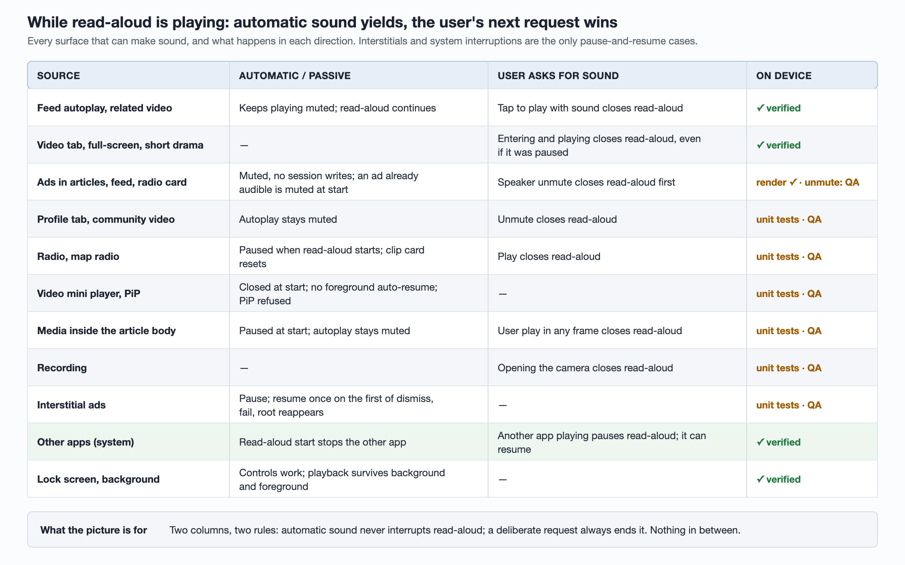

# Tech design: full-article read-aloud on iOS — the player is easy, not being interrupted is the work

We planned a "listen to this article" feature for a news app: a button in the
article's top bar starts a server-generated narration of the full text, a slim
player bar appears above the tab bar, and playback continues after the user
leaves the article, in the background and on the lock screen.

Playing an m4a is a solved problem. What made this a five-week, two-engineer
plan was everything *else* in the app that makes sound. A news app is full of
it: muted autoplay video in the feed, video ads inside articles, interstitials,
an immersive video tab, a short-drama player, a podcast-style audio tab, a
radio card, user-recorded video. Each of them already wrote the global
`AVAudioSession` in its own way, and none of them knew a long-running spoken
session might be holding it.

This is the plan, updated as it is built. The client side is now code-complete
behind a flag; the server field, the narration pipeline, device QA and Android
are not done. §8 says where things stand and what the on-device survey found.

## Summary

- **The data side is one field.** Each article carries an optional
  `narration` object (audio URL, duration, a body revision). No new endpoint.
- **The critical path is not on the client.** The existing narration pipeline
  produced *summaries* and had been switched off; full-article narration had
  to be built. The client develops against a sample file and does not wait.
- **The hard part is audio priority.** A user-started read-aloud outranks
  everything automatic; only the user's *next* deliberate playback ends it.
  Enforcing that means making one object the only writer of the audio session
  and migrating every existing writer to it.
- **Paragraph highlighting is deferred.** It needs a per-paragraph timeline and
  script injection into the article web view; neither is needed to play audio.

## 1. Scope decisions that shaped the design

Most of these looked like product details. Each one turned out to remove or
add a chunk of engineering.

| Question | Decision | Why it mattered |
| --- | --- | --- |
| Who decides whether the button shows? | The server, per article: no `narration` field, no button | The client also has its own default-off experiment flag; both sit in one experiment so neither can ship alone |
| Which articles? | Only first-party full-text articles; never paywalled, never third-party URL articles | The audio URL is a public CDN address. Delivering it for a paywalled article leaks the full text to anyone holding the document — including web routes that return the same object |
| What ends playback? | Tapping ×, or the user starting any other audible playback | "Next deliberate playback wins" became the single rule for the whole priority model (§4) |
| What does *not* end it? | Ads, autoplay, the user leaving the article, a modal covering the player | Playback outlives the page, so the player must live on the window, not in the article |
| Exception | Interstitial ads pause it and resume it when they go away | The only automatic source allowed to touch it, and the hardest to get right (§4.3) |
| Collapse behaviour | The bar collapses into a draggable bubble as soon as the user scrolls | No collapse button and no timer; programmatic scrolls must not count |
| After it finishes | Bar and bubble disappear; speed resets to the default next time | No replay state to model |
| Process killed in background | Not resumed | Accepted as a known gap in "playback ended" analytics |
| Scroll to the paragraph being read | Not in this version | Needs the paragraph timeline, deferred with highlighting |
| VoiceOver | Button shown as usual; VoiceOver wins | Rely on the system's ducking; no auto-collapse while VoiceOver is on |
| Weak network | Retry with backoff 1 s, 2 s, 4 s, then a failed state with a retry button | Count retries in the crash reporter; no offline cache, no cellular warning |
| Article corrected before new audio exists | Keep serving the old audio, swap atomically when the new one is ready | The client never compares versions |

## 2. The data contract

```json
{
  "id": "…",
  "rev": "r3",
  "narration": {
    "url": "https://cdn.example.com/tts/<id>/<random>/r3.m4a",
    "duration_s": 220,
    "rev": "r3"
  }
}
```

Small field, several non-obvious rules:

- **Identical for every user.** The article endpoint caches documents by id for
  hours and shares them across users, so nothing per-user can go in. That is
  also why a signed, expiring URL does not protect paywalled audio: its expiry
  would have to outlive the cache, which makes it a long-lived URL anyway.
- **Walk the field through every layer that copies a document.** Entity,
  outward DTO, response wrapper, protobuf, proto bridge. A layer that whitelists
  fields drops a new one silently — the field "works" in the endpoint you
  tested and is absent in the other four.
- **Omit empty, never `null`.** Clients treat "absent" as "not ready yet".
- **One file per revision; never overwrite in place.** A CDN serves the old
  object until expiry, so a player fetching byte ranges can receive half of
  each version and fail, and the stored duration stops matching. Keep the old
  file for the length of the document cache window, then delete it; delete
  immediately on takedown.
- **`rev` on the audio says which text was narrated.** The server uses it
  to decide when narration is stale. The client records it in its session
  snapshot and otherwise ignores it.
- **Invalidate twice.** After the pipeline writes the field it calls the
  internal cache-invalidation endpoint, then again a few seconds later: cache
  refill reads from a database replica, so an in-flight request can write the
  old value back and pin it for hours.
- **Audio format.** AAC in m4a with `moov` at the front, or constant-bitrate
  MP3. Variable-bitrate MP3 gives wrong durations and seek positions under
  progressive download. The CDN must honour `Range`.

### How stale can the field be when the user taps?

It is the sum of two delays: how old the server's cached document is, and how
long the client has been holding the card. Opening an article from the feed
usually does *not* refetch the document.

| Layer | Refreshes when | Never refreshes when |
| --- | --- | --- |
| iOS client | Pull to refresh; re-tapping Home; cold start or foreground with the feed visible, if the channel's last request is over 10 minutes old (load-more also resets the clock) | Returning from an article; switching tabs; load-more (old cards keep old data) |
| Android client | Pull to refresh; re-tapping the tab; cold start or switching back after 30 minutes; with the process alive, only after 8 hours in background, and not if 3+ unseen cards remain | Same as iOS; the detail page uses the card's copy |
| Server | Document cache 6 h, written with add-if-absent so never extended; the article endpoint stacks a second layer, up to ~12 h | A database write invalidates nothing on its own |

Typical: minutes, if the pipeline invalidates and the user taps a card from
this session. Worst: unbounded within one process. Push-opened articles are
unaffected because they fetch fresh. Conclusions: generate audio before the
article enters recommendation, invalidate on write, and treat a missing field
as "not ready" — never as an error.

The feed's failover pool serves pre-serialized documents that lack the new
field, so the button vanishes during an incident. Accepted.

### On the client

Derive the field from the raw document dictionary, next to similar optional
fields. **Do not reuse** the existing `audioURL`/`audioDuration` accessors:
they read the old summary narration, which another screen still uses.

When the article refreshes (reader-mode toggle, login, subscription change),
the top-bar button reads the newest document. Playback does not: once started,
the session holds an **immutable snapshot** — id, URL, duration, revision,
title — and a refresh only affects the *next* start. Hot-swapping the source
of a playing session is a bug farm.

On Android, the new field on a `Serializable` model must itself be
serializable (a class or a raw JSON string, not `JSONObject`), and the detail
merge step that copies fields by whitelist needs it added.

## 3. The player


Three layers, dependencies pointing down only. The article page knows only
"start or expand". The read-aloud module lives for the process. Underneath sits
one file in the lowest shared library: the session arbiter.

The first draft also put the overlay conventions in a shared UI library and let
every player module call the arbiter directly. The build went further: each
module that makes sound declares only a **narrow protocol of its own** — video,
radio, interstitial, recording, upload overlay — and the app delegate injects
the implementations at launch. No feature module references the arbiter or adds
a singleton, and a lint rule keeps it that way. The overlay registry moved into
the read-aloud module, owned by the app.

### 3.1 Playback core

- **Start with `player.rate = speed`, never `play()`.** On iOS 15, `play()`
  resets the rate to 1×, and `defaultRate` arrived only in iOS 16. Lock-screen
  play, headphone play, resume after interruption and resume after rebuild all
  go through the same entry point.
- `audioTimePitchAlgorithm = .timeDomain` — suited to speech at non-1× rates.
  Speeds cycle 1.2× → 1.5× → 0.8× → 1×; default 1.2×.
- KVO on `item.status` and `timeControlStatus` to tell "failed" from
  "buffering"; refresh the duration once ready.
- States: idle, loading, playing, buffering, paused(reason), ended, failed. On
  interruption end, resume only if `shouldResume` is set, it was playing
  before, and the user did not pause in between. Unplugging headphones pauses.
- **Error -11819** (item invalidated after the app was suspended while paused
  from the lock screen): rebuild from the same URL and seek back — at most once
  per item, counter reset per article, and a rebuild does not log an "ended"
  event. `mediaServicesWereResetNotification` invalidates player *and* category;
  same rebuild path.
- **One render snapshot.** A reducer produces a single value — article, URL,
  position, speed, pause reason, holds-session, holds-lock-screen — and the bar,
  bubble and lock screen only render it. Applying the same snapshot twice must
  be a no-op.
- Report every fallback path to the crash reporter, **deduplicated by article +
  reason**. Ours keeps only a handful of non-fatal events per session;
  duplicates crowd out the ones you need.

### 3.2 The bar and the bubble

- The bar slides in above the tab bar: avatar, title, elapsed / total, −15 s,
  play/pause, +15 s, speed, ×, and a seekable progress line along the bottom.
  The seek gesture has its own ~20 pt hit band so it never overlaps buttons,
  previews the time while dragging, and seeks on release. No collapse while
  dragging.
- **Collapse on user scroll only**: more than 40 pt *and* the scroll view is
  `isDragging` or `isDecelerating`. Code-driven scrolls are not the user.
- The bubble is the avatar with a progress ring, docked to the left edge by
  default (another assistant surface lives on the right), draggable to any
  height, snapping to the nearest edge. Tap expands. Play/pause and stop live
  only on the bar.
- Both attach to the app window just above the root view — so later modals
  cover them, and they survive navigation and tab switches. Log-out and
  language switch rebuild the root, and that single path stops playback.
- **Invariant:** overlay visible ⟺ session not idle. Violations assert in debug
  and report in release.
- Accessibility labels and custom actions on both; dragging is not available
  to VoiceOver users, so nothing depends on it.
- **First play goes through the AI consent screen.** After beta feedback it
  became a bottom sheet over the article instead of a full-screen page. It is
  presented `.overFullScreen`, so the article does not log a "page left" event
  underneath it. Swiping it down counts as "Not now" (no consent, no playback,
  ask again next time) once the drag passes 30% of the sheet height or
  1600 pt/s — the same thresholds as the system sheet. Tapping the dimmed area
  does nothing.

## 4. Audio priority — the real work

### 4.1 The rules

1. **A user-started read-aloud is the highest priority.** Ad video, autoplay
   video, autoplaying media inside the article body: none may override,
   interrupt or stop it. They play muted and do not touch the session.
2. **Only the user's next deliberate playback ends it** — entering the video
   tab and playing, opening a full-screen or short-drama player, pressing play
   in the audio tab or on the radio, tapping an ad's unmute button, starting a
   recording, tapping play on a video inside the article. Ending means *close*
   (stop, dismiss bubble), not pause.
3. **Exception: interstitials** pause it and resume it on dismissal.
4. **System interruptions are the system's.** Calls, alarms, Siri, other apps:
   pause on interruption, resume when `shouldResume` says so.

### 4.2 Two enforcement layers

**Layer 1 — one writer.** All in-app `setCategory` / `setActive` calls (ten
files, twenty-five lines when we counted) move behind an arbiter. Every
playback start asks it first and declares itself *user-initiated* or *passive*.
While read-aloud holds the session, passive requests are told to stay muted
and leave the session alone; a user-initiated request closes read-aloud and
gets the session. A lint rule forbids direct session writes anywhere else.
The companion article
[One writer for the audio session](audio-session-single-writer.md) covers how
the first migration was done.

**Layer 2 — detect and recover.** Some writers are out of reach: third-party
ad SDKs, `AVCaptureSession` reconfiguring the session when recording starts,
media inside `WKWebView`, the system itself. When one of them pauses
read-aloud, resume automatically **only for pause reasons on an allow-list**,
and report it. A stop the user caused (recording, next playback, ×) is never on
the list.

The "waiting to auto-resume" state is cleared by **events, not timers**: the
user pressing play or ×, going to background, coming to foreground (re-read the
session then), the next deliberate playback, an interstitial dismissing.

Two invariants are asserted in unit tests and the device matrix: never two
audible streams at once; and while read-aloud holds the session, no video
player may prepare Picture in Picture and no video mini player may exist —
otherwise backgrounding the app starts automatic PiP and a second voice.

### 4.3 Every source, one row each

| Source | What it did before | What it does now |
| --- | --- | --- |
| In-article video ads (muted by default) | Set the session to `.ambient` on every play — read-aloud became subject to the mute switch and stopped in background | Play muted; category write goes through "set if allowed", which refuses while read-aloud holds the session |
| In-house ad SDK rendering native ads | Was observed calling `setActive(false)` on every render; a later SDK version releases focus by restoring the category without deactivating | Verified on device with the newer version: zero session writes while native ads rendered during read-aloud. No SDK change needed |
| Ad unmute button | Verified on device: unmuting made the SDK set `.playback` and activate the session — two voices at once; muting again only restored the category | A deliberate playback: close read-aloud **synchronously** in the tap handler, then unmute. Every speaker toggle goes through one function, locked by a lint rule. If an ad was already audible when read-aloud starts, it is muted, and a forced mute writes back the view's speaker state |
| Google Mobile Ads video | The SDK manages the session | The app already mutes it globally; while read-aloud plays, also set the SDK's `audioVideoManager.isAudioSessionApplicationManaged = true` (Swift name) so the SDK stops touching the session, and restore it afterwards. The toggle flips correctly; a real video ad has not yet been seen during a test |
| Interstitials (on leaving an article, switching tabs, warm start) | May be audible, may change the session | Pause with a **token**; only a resume carrying the current token takes effect, and a user action in between voids it. List every interstitial's show / dismiss mechanism first — a separate window would need `didBecomeHiddenNotification` or `didResignKey`. The survey found all of ours presented full-screen from the root view controller, so three signals suffice: dismiss callback, presentation failure, root reappearing. The first one resumes; the others are no-ops. That last signal covers an ad SDK that does not report a dismissal. No timer |
| Video tab, full-screen and short-drama players | Wrote `.playback` on appear and `.ambient` on leave | Entering and playing is deliberate: close read-aloud. Leaving writes only if allowed |
| Muted autoplay video under the article | Posted "video will play" whether muted or not | Passive. Only an *audible* start should announce itself; decide that at one choke point in the video controller |
| Podcast-style audio tab | Remote commands registered permanently, including next/previous; a lock-screen play drove both players. Its Now Playing writes were read-modify-write with no ownership check, and its artwork arrived asynchronously | Yields when read-aloud starts; a later play there is deliberate and closes read-aloud. Does not register remote commands or write Now Playing while read-aloud owns them; read-aloud clears `nowPlayingInfo` when it ends |
| Community video | Every mute toggle set `.ambient`/`.playback` with `.mixWithOthers` and activated — turning read-aloud's session mixable | Passive while muted; unmuting is deliberate |
| Radio players | Two radios unaware of each other; one deactivated the session on close | Last user tap wins; deactivate only if allowed |
| Video mini player | Auto-resumed on every return to foreground | Closed when read-aloud starts, with a dedicated reason that is not "user closed"; foreground resume is passive |
| HTML5 media in the article | — | Pause all media when read-aloud starts; body autoplay stays muted; a script injected into every frame reports a user-started, audible `HTMLMediaElement` play to native, which closes read-aloud; its test runs the script in a real `WKWebView` |
| Recording | No `.playAndRecord` anywhere; `AVCaptureSession` changes the session implicitly | Close read-aloud before recording starts, with a reason that never auto-resumes |

Two ordering rules sit under the table. **Ending a session clears the "spoken
session active" flag *before* deactivating**, or the arbiter's own guard blocks
the deactivation and, after × in the background, the user's music never comes
back. A unit test pins the order. And × in the foreground does **not**
deactivate — doing so would stop muted feed autoplay; verify on device.

The same pattern applies to the lock screen: a second lint rule allows only
the read-aloud publisher to write Now Playing.

A side bug found on the way: a radio player observed
`AVPlayerItemDidPlayToEndTime` with `object: nil`, so *any* item finishing —
read-aloud, a feed video — reset its card and logged a false "audio end". Fixed
separately, without a flag.

### 4.4 What we did not reuse

The app already had a playback coordinator for video layers. We kept it out:
it never wrote the session, it was behind an unlaunched flag and idle in
production, and its module carried dozens of dependencies. The arbiter is the
single authority on the session; the coordinator, when it needs sound, asks the
arbiter like anyone else. We did reuse its verification method — multi-channel
reporting, single-focus assertions, a scenario-matrix test.

## 5. Deferred: paragraph timeline and highlighting

Kept in the design so the field shape does not have to change later:

```json
{ "rev": "r3",
  "paragraphs": [ {"p": 1, "start_ms": 0,     "text": "…"},
                  {"p": 2, "start_ms": 24400, "text": "…"} ] }
```

- `p` is a stable paragraph id the content pipeline writes into the article
  HTML. Playing: binary-search the position to find `p`, highlight it. Tapping
  a paragraph: look up `start_ms`, seek. Times are in audio time, so playback
  speed does not matter.
- Download the timeline only after the user starts playback; never inline every
  paragraph's text into every feed document.
- The highlight script is injected at `.atDocumentStart`, waits with a
  `MutationObserver` for the article body, handshakes with native, and listens
  only in the main frame. Spike first: our template writes the page with
  `document.write`, and whether a document-start script survives that was
  verified on macOS WebKit but not on iOS. If it fails, playback ships without
  highlighting.
- Any mismatch between timeline, field and document revision turns highlighting
  off — and only highlighting.

## 6. Plan and cost

| Step | Person-days |
| --- | --- |
| Contract: field on every endpoint, audio format, a cross-platform behaviour contract (mute rule, background, lock screen, interstitials, speeds, analytics) signed off before Android starts | 1–1.5 |
| On-device survey: third-party ad SDK session behaviour, interstitial show/dismiss mechanisms | 1 |
| Flag + module skeleton | 1 |
| Contract layer: arbiter (unavailable to app extensions), overlay conventions; unit tests pinning "flag off ⇒ every write identical to before", mutation-checked | 1.5–2 |
| Migrate every audio source to the arbiter, one PR per source, each behind the flag with a device-observable log line | 7–9 |
| Engine | 2 |
| State machine, render snapshot, session snapshot, seek and speed | 2 |
| Session policy: interruptions, route changes, re-promote after demotion, rebuilds, allow-listed auto-resume | 2 |
| Lock screen single writer; audio tab yields | 1.5 |
| Bar (SwiftUI) | 2.5 |
| Global bubble — the app's second permanent window overlay | 5–6 |
| Article page integration, first-run tip and consent | 3 |
| Analytics: four events, counted per user action | 1 |
| Simulator end-to-end, mutation checks | 0.5 |
| Device matrix: oldest and newest supported iOS, an iPad, AirPods and wired, an account with ad fill; first pass plus regression | 4.5–5 |
| PRs and review | 1 |
| **iOS total** | **36.5–41** |

Two engineers in parallel: one on everything that coordinates *other* audio
(contract layer, migrations, session policy, interstitials, device matrix),
one on the player itself (engine, bar, bubble, lock screen, page integration).
Android was estimated at 20–25 person-days, mostly because its existing audio
player had no speed control, no foreground service and no media session.

Interstitial pause/resume and the session-snapshot accessor add about a day
each. Paragraph highlighting adds ~3.5 days on iOS when it comes back.

## 7. Risks, ranked

1. **Writers the arbiter cannot reach.** Mitigated by the two layers; migrate
   one source per PR, never all at once.
2. **Interstitials sit exactly on "keep listening after leaving the article".**
   Token-based resume; enumerate each interstitial's dismissal signal; stay
   paused when no signal arrives.
3. **The narration pipeline is the critical path**, with no numbers yet for
   capacity, cost or latency — and a breaking story goes from publish to push in
   minutes. First task: a half-day estimate of articles per day, p50 synthesis
   time and monthly cost. The answer may shrink scope to breaking and
   high-traffic articles.
4. **Another player overwrites the lock screen** — fixed by a single writer.
5. **Paywalled audio leaking** — through a mis-delivered field, or because
   `…/<id>/<rev>.m4a` is guessable and an article can become paywalled later.
   Do not synthesize paywalled articles, delete audio when an article becomes
   paywalled, add an unguessable path segment, and keep signed URLs for the day
   subscribers get the feature, behind a per-user URL endpoint.
6. **Android's existing mutual exclusion pauses audio on *any* video start**,
   muted or not. Write the mute rule into the cross-platform contract first.
7. **A third-party SDK closing the session.** Verified gone on device for
   native ad rendering. The survey found the real problem one step over, in the
   ad *unmute* path (§4.3).
8. **Build plumbing**: a new module and a new file in a shared library that
   also compiles into three app extensions. Mark the arbiter unavailable
   to extensions and build every extension target in CI.

## 8. Where it stands

**Done on iOS, all behind a default-off flag:** parsing the field; the top-bar
button with first-play consent; the player (engine, bar, bubble, lock screen);
every in-app session writer migrated, including ads, a single choke point for
video start, the mini player, PiP assertions, community video, both radios,
in-article media and recording; interstitial pause/resume with a one-shot
token; overlay avoidance; the four analytics events; the first-run tip; the
radio's end-of-item fix. Only the arbiter and the audio tab (scheduled for
removal) still write the session. Two surfaces were deliberately left out: an
in-app web-game interstitial and a chat camera.

One review catch worth recording: after the migration, the immersive and
short-drama pages took over an already-playing video without marking the
request *user-initiated*, so read-aloud survived. Automated review flagged it;
on device, read-aloud now closes and the video is audible.

### Mutual exclusion, surface by surface



The rules in §4 now hold on every surface that can make sound: the feed, the
video tab and its full-screen and short-drama players, ads in articles, the feed
and the radio card, the profile tab's videos, both radios, the mini player,
media inside the article body, recording and interstitials. Each one has the
same two answers — automatic sound yields to read-aloud, the user's request
ends it.

Verified on device so far:

- **The video tab and the feed.** With read-aloud playing *or paused*, opening
  the video tab or a video from the feed closes it and only the video is heard.
  Scrolling past muted autoplay leaves it alone.
- **Other apps, both directions.** Starting read-aloud stops audio another app
  was playing. Starting audio or video in another app pauses read-aloud, which
  can be resumed on return. This is the system's interruption path, so no app
  code makes it work — but a wrong category or options would break it, so it
  is worth testing.
- **Lock screen and background.** Lock-screen controls work, playback survives
  leaving the article, going to background and coming back. After entering and
  leaving a video page, read-aloud is still audible with the mute switch on —
  the video page's old `.ambient` write no longer leaks into it.
- **Teardown.** Logging out or switching language stops it.

The rest of the matrix is covered by unit tests and mutation checks and is with
QA on devices.

**On-device survey** (one recent iPhone, with an uncommitted swizzle probe that
logged every `setCategory` / `setActive` caller):

| Check | Result |
| --- | --- |
| In-house SDK rendering native ads during read-aloud | Pass: zero session writes, lock-screen playback continued |
| Unmuting an in-article ad | Fail before the fix: two voices; fixed by the single speaker path |
| Google Mobile Ads session hand-off | The flag toggles at start and end; no video ad appeared, so not verified |

**Not done:** the server field is not merged; the narration pipeline (still the
critical path) has not started; the device matrix — fifteen items across iOS
versions, an iPad, AirPods and wired headphones, an account with ad fill, plus
the consent sheet's swipe and animations — is with QA; a bug where the first-run
tip does not appear is being fixed; Android has not started.
