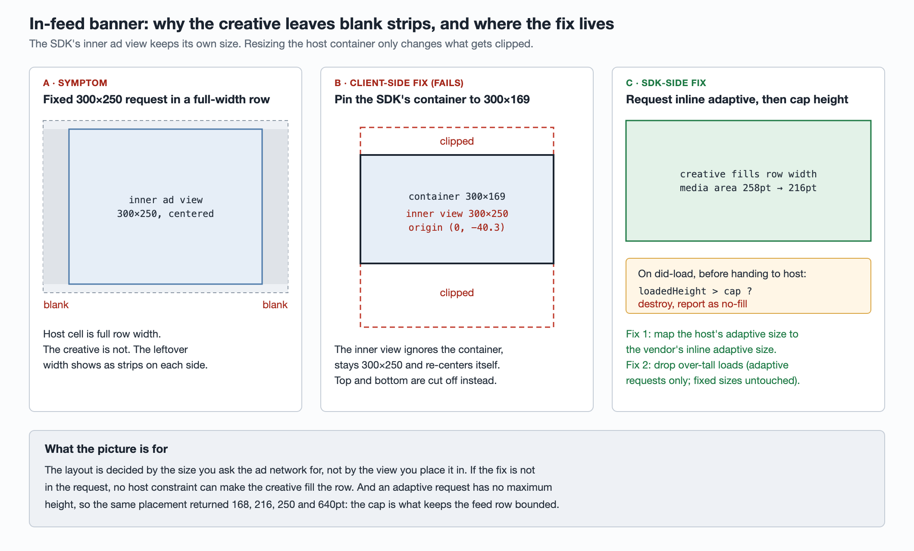

# Moloco in-feed banners with black bars: the fix belongs in the ad request, not the host view

A Moloco banner placed in a full-width feed row showed an empty bar down each
side: the creative sat in the middle and never filled the row. The obvious
reaction is to fix it in the host app by constraining the ad view differently.
Every host-side attempt failed (four, in our case, all reverted), because the
size that matters is decided inside the SDK before the host view is involved.

## The mechanism

The ad was requested at a fixed medium-rectangle size, 300×250. The SDK renders
the creative into an inner view of exactly that size and centers it inside
whatever container the host gives it.

That is why the host can't fix it from outside. Pinning the container to another
size does not resize the inner view. It only changes which part of it is
visible. We measured this: with the container pinned to 300×169, the inner view
was still 300×250, placed at `y = −40.3` and clipped top and bottom. A wider
container gives you side bars, a shorter one gives you a cropped creative, and
no constraint gives you a creative that fills the row.

So if a host-side layout fix doesn't work the first time, stop and dump the ad
SDK's view hierarchy with frames. One `po` of the inner view's frame would
have ruled out all four client attempts.

## The fix: two changes, not one

The fix went into the mediation SDK, which sits between the app and Moloco.

| # | Change | Effect |
| --- | --- | --- |
| 1 | Map the host's "adaptive banner" size to Moloco's **inline adaptive** size instead of the fixed 300×250 | The creative fills the row width. The media area went from 258pt to 216pt tall |
| 2 | **Cap the height** of adaptive loads: in the did-load callback, before the ad reaches the host, compare the loaded height with a cap. If it is over, destroy the ad and report the attempt as no-fill | An over-tall creative never reaches the feed |

The cap only applies to adaptive requests. Fixed sizes (MREC, standard banner)
are left alone, and so is an adaptive request where the host did not pass a
height.

### Why the cap is needed

Inline adaptive fixes the width, but it puts no upper bound on height. Two
measurements supported the second change:

1. **Height is stable at did-load.** Reading the ad's size at +0, +0.1, +0.3,
   +1, +3 and +6 seconds after the did-load callback returned the same value
   every time. So you can decide on the height inside did-load.
2. **Height is not predictable.** The same test placement returned heights of
   168, 216, 250 and 640pt. "It will probably stay around 250" is a guess, not
   a contract. The SDK can't rely on it.

### Why drop instead of resize

A friendlier option is to rebuild the ad at a narrower width so its height
fits. We chose to drop it because dropping avoids three questions we couldn't
yet answer:

- Does the destroyed load count as an impression, and is it billed?
- Is the extra latency of a second load acceptable in a scrolling feed?
- Is it safe to tear down and recreate the viewability (OMID) measurement
  session?

Treat this as an interim decision. Once the vendor answers those questions, a
"scale the width down and rebuild once" strategy can replace it. If the vendor
ever adds a max-height variant to its adaptive size, the whole check can go.

## Why QA still saw the bug after the fix merged

Beta testers reported the bars were still there. The fix was fine. The beta
build had been pinned to a **prerelease** of the SDK that was cut before the
fix merged, so that verification round was invalid.

Before you accept a "still broken" report, check which exact dependency version
the build contains. With prerelease tags, "we upgraded the SDK" and "this
build has the fix" are separate claims.

## A PR description can cover less than the PR

The fix PR's description, with before/after screenshots, covered only the first
change. The height cap came in a later commit, and its rationale was only in the
review comments. Someone who reads just the description concludes the PR does
not deal with creative height at all, which is wrong. When you review or cite a
PR, read the commit list and the comment thread, not only the description.

## Verifying it: keep the two criteria apart

The two changes fail independently, so they need separate checks:

| Criterion | How to check |
| --- | --- |
| Side bars are gone | Look at the ad in the feed. The creative should fill the row |
| Over-tall creatives are dropped | Search the client log for the SDK's "banner dropped" line. If it appears, the cap is working, and the count gives you the drop rate |

A clean feed only proves the first. It says nothing about whether the cap ever
fired.

## Recommendations

- **Fix ad layout at the request, not the container.** If the SDK owns an inner
  view with a fixed size, host constraints can only clip it.
- **Watch the drop rate.** It decides whether dropping over-tall creatives is
  acceptable long term, because every drop is a lost fill. Log the request
  width, the returned size and the cap for each drop so you can compute the
  rate in production, and make sure someone owns the number.
- **Ask the vendor for a max-height adaptive size.** It would replace the
  client-side check entirely.
- **Isolate test-fill toggles.** A debug switch that forces Moloco test ads
  locks the ad network, turns on test mode and swaps the placement, and only
  takes effect after an app restart. Leaving it on while you verify something
  unrelated skews that result. Run those checks in separate passes.
- **Confirm the exact SDK version in the build** before you act on a
  verification result, especially when prerelease tags are in play.
