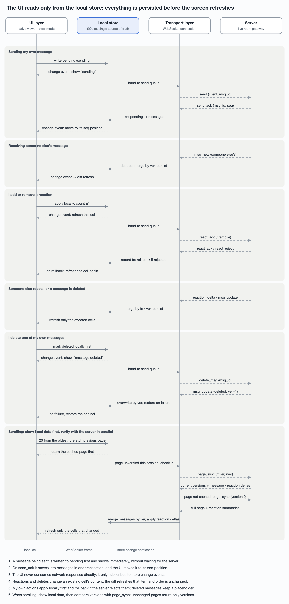
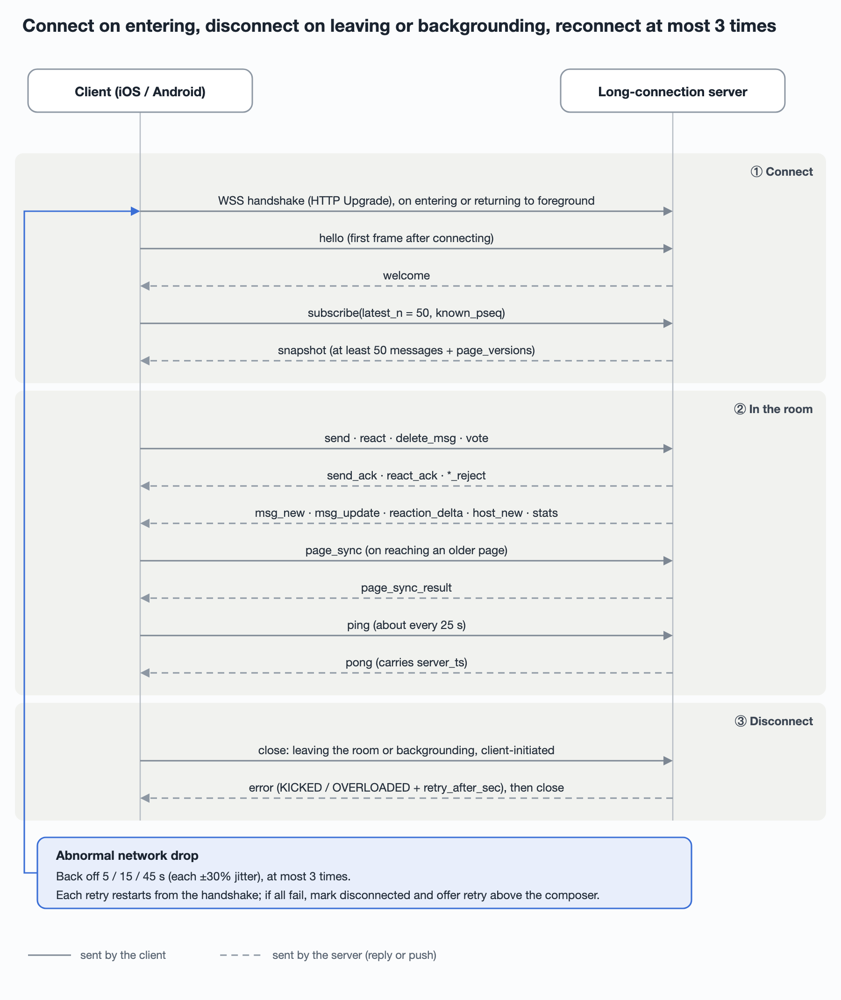
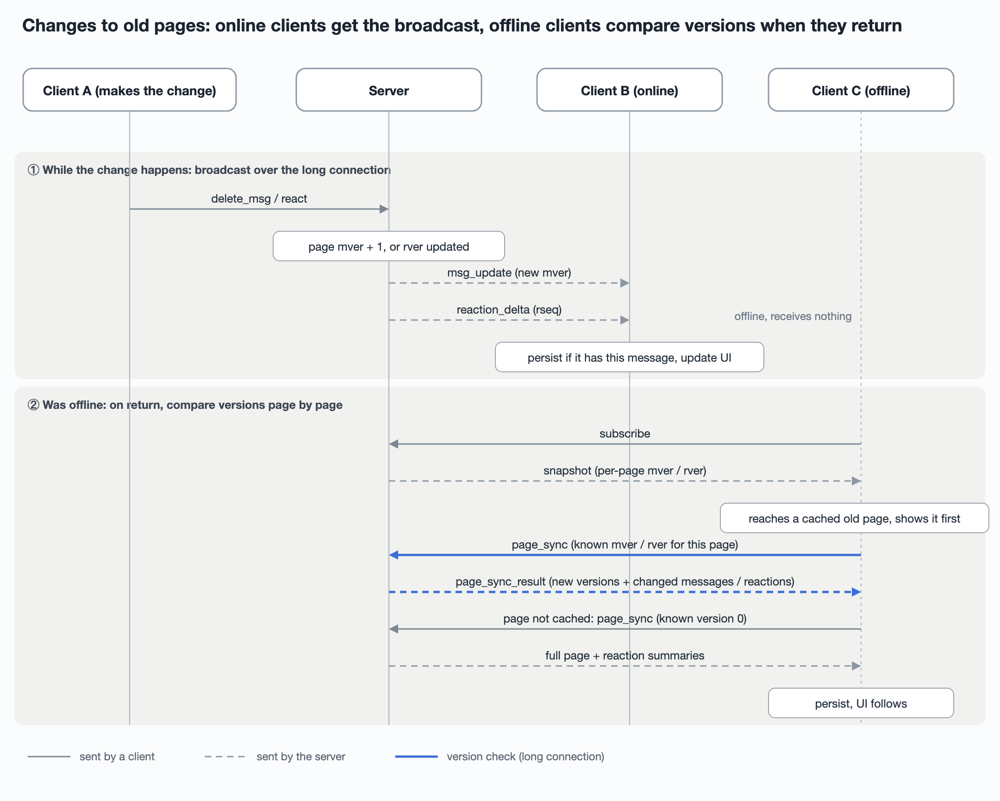

# Tech design: a native long-connection client for a live chat room

A live room is a chat that forms around a breaking news event: many readers, one
AI host that posts updates and polls, and a few hours of intense traffic before
the room winds down. This is the client-side design for it — the local store, the
transport, and the UI — written so that iOS and Android can implement it
independently and still behave identically.

## Summary

The client has three layers, and **all three are implemented natively on iOS and
on Android**. The two platforms share one message definition, one schema
document and one set of test cases to keep their behaviour aligned. The long
connection is WebSocket carrying protobuf binary frames, native only, with no Web
or H5 client in scope. Messages are designed to be transport-agnostic, so moving
to gRPC later only replaces the transport layer.

- The connection exists only while the room screen is in the foreground. The
  "Watch for me" alert after you leave the room goes through APNs / FCM push
  ([2.3](#23-push-and-room-info)) and does not depend on the long connection.
- The long connection carries new messages in both directions (sending,
  reactions, deletes and other real-time actions go over it too). Entering a room
  shows the latest messages first (at least 50, with the starting point aligned
  to a multiple of 100). Scrolling up through history also uses the long
  connection, fetched page by page over `seq` ranges
  ([Appendix A](#appendix-a-history-over-the-long-connection)). Later changes to
  messages already fetched (deletes, reactions) are synced over the long
  connection too; see [2.5](#25-page-version-sync-websocket).

## Layering

Data flows one way: whatever the transport layer receives is written to the local
store first. The UI layer reads only from the store and subscribes to its changes
([Appendix G](#appendix-g-store-change-notifications)); it never uses network
responses directly. User actions go from the UI layer to the transport layer.

| Layer | Responsibility | Implementation |
| --- | --- | --- |
| 1. Local store | SQLite persistence, in-memory window, merge rules, gap ranges, reaction structures | iOS: SQLite + FMDB ([Appendix B](#appendix-b-choosing-the-local-database)), already in the project; Android: Room |
| 2. Transport | Connection, heartbeat, reconnect, subscribe, send and ack, history paging, adding and removing reactions | iOS: `URLSessionWebSocketTask` + SwiftProtobuf; Android: OkHttp WebSocket + protobuf |
| 3. UI | List rendering, scroll anchoring, new-message prompt, sending state | Native on each platform |



When sending, the client writes to the database before going to the network.
Acks and other people's messages are also written to the database first, and the
UI refreshes only on change events from the store.

## Part 1: Local store (native on both platforms)

The database is the system SQLite
([Appendix B](#appendix-b-choosing-the-local-database)): FMDB on iOS and Room on
Android, both already present in their projects. Each platform implements the
same schema below. The cache is only for fast display; the server-issued `ver`
([Appendix E](#appendix-e-the-message-version-ver)) is authoritative.

There are eight tables. Only the fields needed for querying, merging and cleanup
are split into columns; everything else is stored as protobuf bytes, so adding a
field to a message does not require a schema change.

- **Types**: every id field (room, message, client-generated ids) is a UUID.
  SQLite has no UUID type, so it is stored as a 16-byte BLOB — less than half the
  size of the 36-character text form and faster to compare. Message ids should be
  time-ordered UUIDv7 for better index locality on insert. User ids follow the
  existing account system. INTEGER is a signed 64-bit integer; all times are UTC
  milliseconds.
- **Source**: "server" names the frame or endpoint the value comes from; "local"
  means generated by the client or extracted from server data.

### `rooms`: room-level state

| Column | Type | Constraint | Source | Notes |
| --- | --- | --- | --- | --- |
| `room_id` | BLOB (UUID) | Primary key | Server: room list endpoint ([2.4](#24-room-list-and-entry-points-rest)), `snapshot.room` | Room id |
| `title` | TEXT | NOT NULL | Server: room list endpoint, `snapshot.room` | Room title, for list display and local search ([Appendix D](#appendix-d-searching-room-titles)) |
| `state` | INTEGER | NOT NULL | Server: room list endpoint, `snapshot.room`, `stats.state` | 1 LIVE / 2 WARM / 3 CLOSED |
| `here_count` | INTEGER | NOT NULL, default 0 | Server: room summary endpoint ([2.4](#24-room-list-and-entry-points-rest)), `stats.here_count` | Only for the list's first screen; inside the room, live `stats` wins |
| `head_seq` | INTEGER | NOT NULL | Server: `snapshot.head_seq`; afterwards the local max of received `msg_new.seq` | Current highest seq |
| `last_read_seq` | INTEGER | NOT NULL, default 0 | Local: written on leaving the room and reported with `mark_read`; the room list endpoint also returns the server value, take the larger | Unread = `head_seq` − `last_read_seq` |
| `last_visited_at` | INTEGER | NOT NULL | Local: written on entering | Cleaned up after 7 days without a visit |
| `closed_at` | INTEGER | Nullable | Server: room list endpoint, `snapshot.room` | Non-null means eligible for cleanup |
| `card` | BLOB | Nullable | Server: room list endpoint, room info endpoint | Protobuf bytes of the remaining card display fields (tag, cover, the host's one-liner, unread count, …) for the list's first screen |

### `messages`: confirmed room messages

| Column | Type | Constraint | Source | Notes |
| --- | --- | --- | --- | --- |
| `room_id` | BLOB (UUID) | Part of composite PK | Server: `snapshot.messages`, `msg_new`, `msg_update`, page_sync when paging | Different rooms can share a seq |
| `seq` | INTEGER | Part of composite PK | Server: as above | Assigned by the server; used for ordering and paging |
| `msg_id` | BLOB (UUID) | NOT NULL, unique index | Server: generated when the message is persisted, delivered in `send_ack` (to the sender) and `msg_new` (to everyone) | Dedupe; lookup when jumping to a reference |
| `ver` | INTEGER | NOT NULL | Server: as above | On merge, larger overwrites smaller |
| `server_ts` | INTEGER | NOT NULL | Server: as above | Display time ([Appendix C](#appendix-c-displaying-time)) |
| `status` | INTEGER | NOT NULL | Server: as above; deletes and hides arrive via `msg_update` | 1 normal / 2 deleted / 3 hidden; deleted messages keep a placeholder row |
| `kind` ([Appendix F](#appendix-f-content-kind-and-references)) | INTEGER | NOT NULL | Local: extracted from `body.content` on insert | 1 text / 2 poll / 3 summary line; the host's polls panel filters on it |
| `reply_to_msg_id` ([Appendix F](#appendix-f-content-kind-and-references)) | BLOB (UUID) | Nullable, indexed | Local: extracted on insert from the room-message reference in `body.refs` with rel = reply | The id of the message being replied to; used for jump-to-reference and "all replies to this message". Replies to article comments, quotes and other references stay only in `body.refs` |
| `sender_uid` | TEXT | NOT NULL | Local: extracted from `body.sender` on insert (existing user ids) | @-mention candidates are the room's recent speakers |
| `body` | BLOB | NOT NULL | Server: the whole `Message`, stored as is | Protobuf bytes of the whole `Message` (content, references, sender); its reaction summary is read once on insert, after which `reaction_summary` is authoritative |

Index: (`room_id`, `kind`, `seq`) for the poll list. The primary key already
covers paging by seq.

### `users`: sender profiles

When drawing a message, look up `sender_uid` here for name, avatar and place.
Every message's `body.sender` also carries the profile as of sending, and is used
to update this table on insert; after someone renames or changes their avatar,
old messages show the latest profile too.

| Column | Type | Constraint | Source | Notes |
| --- | --- | --- | --- | --- |
| `uid` | TEXT | Primary key | Server: the message's `sender` | User id, existing system |
| `kind` | INTEGER | NOT NULL | Server: `sender.kind` | 1 regular user / 2 host / 3 system |
| `name` | TEXT | NOT NULL | Server: `sender.name` | Display name |
| `avatar` | TEXT | Nullable | Server: `sender.avatar` | Avatar URL; if empty, render an initials placeholder |
| `place` | TEXT | Nullable | Server: `sender.place` | Location, e.g. "Columbus, OH" |
| `profile_ver` | INTEGER | NOT NULL | Server: `sender.profile_ver` | Profile version; only a larger one overwrites, so a stale profile in an old message cannot clobber a newer one |
| `updated_at` | INTEGER | NOT NULL | Local: write time | For pruning records not referenced for a long time |

If a message's sender has no row here yet (rare, since insert writes it), fall
back to `body.sender`.

There is no dedicated profile sync protocol; profiles ride along with other data:
① every new message's `sender` carries the current profile and `profile_ver`;
② `snapshot` includes the latest profiles of the senders in it (`snapshot` is
live). History pages are cached per page and contain profiles as of sending, but
merging by `profile_ver` never overwrites a newer profile. A room lasts only a
few hours, so showing an old name for someone who never speaks again is
acceptable (pending product confirmation).

### `host_messages`: private host messages (ONLY YOU)

| Column | Type | Constraint | Source | Notes |
| --- | --- | --- | --- | --- |
| `room_id` | BLOB (UUID) | Part of composite PK | Server: `snapshot.host_messages`, `host_new` | Room id |
| `pseq` | INTEGER | Part of composite PK | Server: as above | The user's own private sequence number |
| `anchor_seq` | INTEGER | NOT NULL | Server: as above | Which room seq it appears after; interleaved when reading `messages` by page |
| `msg_id` | BLOB (UUID) | NOT NULL, unique index | Server: as above | Dedupe |
| `server_ts` | INTEGER | NOT NULL | Server: as above | Display time |
| `body` | BLOB | NOT NULL | Server: the whole `Message`, stored as is | Private message content |

Index: (`room_id`, `anchor_seq`).

Ordering: when room messages and private host messages are merged into one
timeline, sort by a triple. A room message is (`seq`, 0, 0); a private message is
(`anchor_seq`, 1, `pseq`). A private message therefore appears after the room
message whose seq equals its `anchor_seq`, and several private messages at the
same position are ordered by `pseq`. The server fills `anchor_seq` with the
current `head_seq` when it generates the private message. `pseq` increases only
within this user's own private messages; it is used for dedupe and gap detection
and is never compared with room seq. Messages still being sent always sort last.

### `pending`: messages being sent or failed

| Column | Type | Constraint | Source | Notes |
| --- | --- | --- | --- | --- |
| `client_msg_id` | BLOB (UUID) | Primary key | Local: generated on send | Unchanged across retries |
| `room_id` | BLOB (UUID) | NOT NULL | Local: current room | Room id |
| `created_at` | INTEGER | NOT NULL | Local: written on send | Orders multiple unconfirmed messages |
| `state` | INTEGER | NOT NULL | Local: set to failed on `send_reject` or timeout | 1 sending / 2 failed |
| `attempts` | INTEGER | NOT NULL, default 0 | Local: +1 per send | Attempts so far |
| `reject_code` | INTEGER | Nullable | Server: `send_reject.code` | Decides whether retry is allowed: under review / rejected / not permitted |
| `body` | BLOB | NOT NULL | Local: protobuf bytes of the `Send` frame | Resent verbatim |

Index: (`room_id`, `created_at`). On `send_ack` or your own `msg_new`, write to
`messages` and delete this row in the same transaction.

### `reaction_summary`: per-message, per-emoji summary

| Column | Type | Constraint | Source | Notes |
| --- | --- | --- | --- | --- |
| `msg_id` | BLOB (UUID) | Part of composite PK | Server: `Message.reactions`, `reaction_delta` | Message id |
| `emoji` | TEXT | Part of composite PK | Server: as above; written locally first for your own actions | An emoji or a fixed key (e.g. `metoo`) |
| `count` | INTEGER | NOT NULL | Server: `Message.reactions.count` on insert, then ±1 per `reaction_delta`; ±1 locally first for your own actions | Total |
| `me` | INTEGER | NOT NULL | Server: `Message.reactions.me`; changed locally for your own actions | 0 / 1, whether I have reacted |
| `earliest` | BLOB | NOT NULL | Server: `Message.reactions.earliest` | The first 3 reactors (protobuf bytes of a `Reactor` list) |
| `ver_ts` | INTEGER | NOT NULL | Server: `reaction_delta.ts`, `react_ack.ts` | Timestamp of the last applied add/remove; older deltas are dropped |

If one of the earliest three removes their reaction, the client has no fourth to
promote, so `earliest` temporarily holds fewer than three until the message comes
back in a `snapshot` or page_sync and overwrites it.

### `reactions`: reaction details

| Column | Type | Constraint | Source | Notes |
| --- | --- | --- | --- | --- |
| `msg_id` | BLOB (UUID) | Part of composite PK | Server: `reaction_delta`, incremental ops in `page_sync_result`, the reactor list endpoint | Message id |
| `emoji` | TEXT | Part of composite PK | As above; written locally first for your own actions | Emoji or fixed key |
| `uid` | TEXT | Part of composite PK | As above | The reacting user; name and avatar come from `users` |
| `ts` | INTEGER | NOT NULL | Server: operation timestamp | The list is ordered earliest first; for the same (msg_id, emoji, uid) the larger ts wins |

Index: (`msg_id`, `emoji`, `ts`). Removing a reaction deletes the row.

### `reaction_lists`: list completeness

| Column | Type | Constraint | Source | Notes |
| --- | --- | --- | --- | --- |
| `msg_id` | BLOB (UUID) | Part of composite PK | Local | Message id |
| `emoji` | TEXT | Part of composite PK | Local | Emoji |
| `complete` | INTEGER | NOT NULL | Local: set to 1 after one full fetch of the list | 1 means `reactions` holds the full list for this emoji; 0 means only scattered entries |
| `synced_rver` | INTEGER | NOT NULL | Local: the page version last synced | If it falls behind the page's current `rver` and no delta is available, set `complete` to 0 and refetch next time the list opens |

When showing a list: if `complete = 1`, read straight from `reactions`; otherwise
call the paged reactor list endpoint and set it to 1 afterwards. The total shown
in the message list always comes from `reaction_summary`, since the details may be
partial.

### Review decisions

- **Drop the `segments` table.** Seq is contiguous and deleted messages keep a
  placeholder, so whether a range is complete can be decided by checking that the
  row count in that range equals its length (via the primary key index). There is
  no need to maintain a separate table and its merge rules.
- **Persist reaction details.** Every reaction goes into `reactions`, and
  `reaction_lists` records which lists are complete. How deltas are fetched and
  applied when revisiting old messages is in
  [2.5 Page version sync](#25-page-version-sync-websocket).
- **Add `host_messages` and `rooms`.** Private messages do not consume room seq,
  so they cannot live in `messages`; cleanup rules and unread counts need
  room-level fields.
- **Add `messages.kind`.** The host's polls panel has to filter out poll
  messages by type; otherwise it would decode every `body`.
- **A message being sent is not a real message.** Until the server confirms it
  (assigns a seq) it exists only in `pending`, not in `messages`. It takes no part
  in seq ordering, gap detection or history paging, and it cannot be referenced,
  replied to or reacted to. It has exactly two states: sending and failed.
- **Merge rules.** Dedupe by `msg_id`; a larger `ver` overwrites a smaller one. A
  `pending` row moves into `messages` by `client_msg_id` and receives its real
  seq on `send_ack` or your own `msg_new`; on `send_reject` it is marked failed.
- **In-memory window.** Keep at most 300 messages in memory; drop the rest and
  read them back from SQLite when needed.
- **Cleanup.** Delete a room's data after 7 days without a visit (a room can
  close and reopen, so it is not deleted on close). Keep at most 2,000 messages
  per room.

Storage additions: `page_versions(room_id, page_start, known_mver, known_rver,
verified)` records the known message version and reaction version for each page;
`verified` says whether the page has been confirmed during the current
connection. `rooms` gains `reaction_rseq`, the last contiguously received `rseq`.
The sync mechanism is in 2.5.

**In-memory reaction structure.** Each message holds a hash map of
`emoji → ReactorList`. A `ReactorList` is a hash map of `uid` → linked-list node
plus a doubly linked list ordered by `ts`, earliest first — a LinkedHashMap.

This structure mirrors the `reactions` table. When the user opens the list for one
emoji on one message, it is built from the table in `ts` order (if incomplete,
first call `GET /messages/{msg_id}/reactions` to fill it in and persist). While
the list is open, each `reaction_delta` is written to the table and applied to the
structure; closing the list frees it.

| Operation | How | Complexity |
| --- | --- | --- |
| Add | Ignore if the `uid` is already in the map; otherwise append to the tail | O(1) |
| Remove | Find the node via the map and unlink it | O(1) |
| Have I reacted | Look up my own `uid` in the map | O(1) |
| Total | Size of the map | O(1) |
| Iterate earliest first | Walk from the head | O(k) |
| An earlier entry arriving late | Search backwards from the tail for its slot | Amortized close to O(1), since it is almost always near the tail |

- Android uses `java.util.LinkedHashMap` directly. iOS has nothing ready-made
  (removal in swift-collections' `OrderedDictionary` is O(n)), so it implements
  "hash map + doubly linked list" itself, with unit tests.
- The server assigns `ts` in arrival order within a room, so additions almost
  always append at the tail.
- The full list for a hot message does not stay resident. Normally only the
  summary is used (total, whether I reacted, first three); the full structure is
  paged in and built only when the user opens the list.

## Part 2: Transport layer (native on both platforms)

The transport layer owns every interaction with the server. Every frame it
receives is written to the store; nothing is handed to the UI directly.

### 2.1 Connection management (WebSocket)

These requirements hold regardless of the transport finally chosen.

- **Lifecycle**: on entering the room, connect, send `hello`, then
  `subscribe(latest_n = 50)`; disconnect on leaving.
- **Heartbeat**: roughly every 25 seconds. Carrier NATs can reclaim idle
  connections after as little as about 30 seconds.
- **Foreground and background**: disconnect proactively on going to the
  background; do not try to keep the connection alive. On returning, subscribe
  again and fetch the latest 50 as on entering, rather than resuming from where
  it dropped.
- **Reconnect**: exponential backoff with random jitter (5, 15, 45 seconds, each
  ±30%), so that a server deploy or node restart does not make every client
  reconnect at once. At most 3 automatic attempts (about 65 seconds). The count and
  intervals are remote config and can be tuned by experiment. When the server is
  overloaded it includes `retry_after_sec` in `error`, and the client waits at
  least that long. Reconnect parameters are fetched with remote config at app
  launch and cached locally, so nothing has to be delivered during an incident;
  if they were never fetched, built-in defaults apply. If all attempts fail, stop,
  set the connection state to "disconnected" and mark every message being sent as
  failed. From then on, restart only on network recovery, returning to the
  foreground, or the user tapping retry. This usually means the network is
  unreachable or the server is down.
- **Only verifiable on a real device**: switching between Wi-Fi and cellular,
  returning from the lock screen, and weak networks. The simulator cannot
  exercise them.



Solid lines are frames sent by the client; dashed lines are server replies or
pushes. After an abnormal drop the client reconnects with backoff, and every
attempt starts again from the handshake, `hello` and `subscribe`.

### 2.2 Sending and receiving (WebSocket)

- **Send**: generate a `client_msg_id`, have the store write a "sending" record,
  then send `send`. `send_ack` / `send_reject` go to the store to update that
  record. While the connection is healthy, resend automatically with exponential
  backoff: first resend after 15 seconds without an ack, second after another 30,
  third after another 60; still no ack means failed. No resends while
  disconnected; after a successful reconnect, resend every pending message once,
  and if that fails, mark it failed immediately. After failure the user chooses
  retry or delete. Every resend uses the same `client_msg_id`, and the server is
  idempotent on it, so nothing is persisted twice.
- **Receiving new messages**: `snapshot`, `msg_new`, `msg_update` and `host_new`
  go to the store as is.
- **History paging**: when the UI asks for the previous page, the transport sends
  `page_sync` with the page [S−100, S) at known version 0. The server returns the
  whole page of messages (`PageMessages.full = true`) and the whole page of
  reaction summaries in `page_sync_result`. S must be a multiple of 100: aligning
  everyone's requests lets the server share a cache keyed on (room, page,
  version). Because the snapshot's starting point is already aligned to 100, the
  first scroll-up uses the earliest loaded seq as S, then subtracts 100 each
  time. Filling downwards works the same way with [S, S+100). Responses are
  deduped by `msg_id` and overwritten by `ver`. Later changes to pages already
  cached are fetched as diffs through `page_sync` too; see 2.5.
- **Seq gaps**: if a received `msg_new.seq` skips 100 or fewer, fill the page it
  lands in with page_sync; if it skips more, have the store record a gap.
- **Reactions**: send `react(add / remove)`, have the store apply it locally
  first, and roll back on `react_reject`. The sync mechanism is in 2.5.
- **Other actions**: `typing`, `vote`, `catch_up`, `mark_read`. "Watch for me" is
  a push subscription and goes over REST.

**Private host messages and room messages are fetched separately:**

| | Room messages | Private host messages |
| --- | --- | --- |
| Live push | `msg_new` (WebSocket) | `host_new` (WebSocket, recipient only) |
| Enter / reconnect | `snapshot.messages`: the latest 50–149 | `snapshot.host_messages`: every private message with `pseq` above the `known_pseq` the client reports |
| History | Paged over the long connection (page_sync), cached per page on the server | Not paged. One person has few private messages per room, so they are all filled in on entry; content differs per user and stays out of the server's shared cache |
| Missed-message detection | Seq gap | On a pseq gap, `subscribe` again with the current `known_pseq` |

### 2.3 Push and room info

Channels: push goes through APNs / FCM; room info goes over REST.

A push carries only ids and the trigger reason, not room state. By the time the
user taps it the room may have gone from LIVE to CLOSED, so before opening, call
the room info endpoint ([below](#room-info-endpoint-getroominfo)) for the current
state and decide which screen to open.

Push payload (APNs custom fields; FCM's data field has the same shape):

```json
{
  "aps": { "alert": { "title": "Live room", "body": "..." }, "thread-id": "liveroom_<room_id>" },
  "live_room": {
    "room_id": "0192f1c4-...",
    "reason": "reply",
    "msg_id": "0192f1c9-...",
    "seq": 1024,
    "sent_at": 1757865600123
  }
}
```

| Field | Required | Notes |
| --- | --- | --- |
| `room_id` | Yes | Room UUID (as a string) |
| `reason` | Yes | `open` (room opened) / `reply` (someone replied to you) / `update` (host update) / `heat` (activity change) / `wrap_up` (room winding down) / `reaction` (someone reacted to your message). The first five match the prototype's pushes; whether each is enabled and its frequency cap are product decisions. An unknown `reason` is treated as a plain room entry |
| `msg_id` / `seq` | No | Present for `reply` and `reaction`; after opening, jump to that message |
| `sent_at` | Yes | Push send time, for measuring push-to-open latency |

#### Room info endpoint (getRoomInfo)

`GET /rooms/{room_id}` also returns what the room profile screen shows:

| Field | Notes |
| --- | --- |
| `room_id`, `title`, `state`, `here_count`, `closed_at` | Same as `RoomInfo`; written to the `rooms` table |
| `started_at` | When the room opened |
| `message_count` | Total messages so far |
| `story_so_far` | The "story so far" cards (label + text) |
| `related_docids` | Articles linked to this event |
| `joined` | Whether I have joined; if not, show the profile and a Join button |
| `watching` | Whether I have "Watch for me" on |
| `head_seq`, `last_read_seq` | For the unread count |

Flow after tapping a push:

1. Show the title and a loading state from the cached `rooms` row while calling
   `GET /rooms/{room_id}`.
2. **CLOSED**: open the wrap-up summary screen; no long connection.
3. **LIVE / WARM**: enter the room directly (connect + `subscribe`). In the
   prototype, entering a room joins it, so the server records the room as
   "joined" on `subscribe`; there is no separate join endpoint. For
   `reason = reply`, jump to the `msg_id` once the `snapshot` arrives; if it is
   not in the snapshot, fetch one page on either side of its seq.
4. **Room missing or request failed**: show a message and return to where the
   user came from; report failed requests as a non-fatal to your crash reporter.

The room list endpoint and the room info endpoint return the same room structure,
and the store merges them by `room_id`. The room profile fields in the prototype
still need checking against the design files.

### 2.4 Room list and entry points (REST)

The room list and every entry point use REST, never the long connection. The long
connection exists only while the room screen is in the foreground. Participant
and unread counts on a list being tens of seconds stale is acceptable, whereas
subscribing to several rooms at once for a list would make server fan-out and
connection management much more complex. The prototype has four room-list
surfaces:

| Screen / entry | Shows | Endpoint | Refresh |
| --- | --- | --- | --- |
| "N live" in the feed's top corner | Number of open rooms | `GET /rooms/entry` | When the feed becomes visible, on returning to the foreground, every 60 s; also on receiving a live-room push |
| "YOUR LIVE ROOM" banner at the top of the feed | Rooms I joined that are still running: unread count, whether someone replied to me, a one-line latest update | Same request as above | Same as above |
| Room tag on feed article cards | "312 talked about this · join", "Live room closed · 2,400 were here" | Delivered with the feed response: each article carries a room summary field, no extra request | With the feed refresh |
| Live rooms screen | Two sections: ROOMS YOU JOINED and OPEN NOW | `GET /rooms?section=joined&cursor=` / `GET /rooms?section=open&cursor=` | On entering, pull to refresh, returning to foreground; while visible, batch-refresh counts every 30 s with `GET /rooms/summary?ids=` |

Room card fields (shared by the list endpoint, the room info endpoint and the
feed summary; the feed uses only a few):

| Field | Notes | Where in the prototype |
| --- | --- | --- |
| `room_id`, `title`, `state` | Room id, title, LIVE / WARM / CLOSED | Every card |
| `tag` | Category tag, e.g. BREAKING, NATIONAL, LOCAL · OHIO | OPEN NOW |
| `opened_at` / `closed_at` | Open / close time | "opened 12:04 PM", "Yesterday" |
| `thumbnail_url` | Cover image | ROOMS YOU JOINED |
| `host_line` | One-line status written by the host | OPEN NOW, feed banner |
| `here_count` | People in the room now | "1,240 here" |
| `msgs_per_min` | Current message rate | "10 msgs/min" |
| `peak_count` | Total people who have visited | "3,100 were here" |
| `joined` | Whether I have joined | Decides Join vs. enter |
| `unread_count` | Computed by the server as `head_seq − last_read_seq` | "N new since you left", banner badge |
| `replied_to_me` | Whether someone replied to me since I left, with their name | "Marcus replied to you" |
| `my_poll_votes` | How many polls I voted in here | "you voted in 2 polls" |
| `summary_ready` | Whether the wrap-up summary is ready | "summary ready" |

Storage: cards returned by the list endpoint are written to `rooms`; the next
time the list opens it shows the cache and then refreshes. Tapping a card behaves
like tapping a push: LIVE / WARM enters the room, CLOSED opens the wrap-up
summary.

One thing the feed backend has to provide: the feed response must add a room
summary field (`room_id`, `state`, `here_count`, `peak_count`, `joined`) to
articles that have a room; otherwise the client would need an extra request per
article.

### 2.5 Page version sync (WebSocket)

An old message being deleted or edited, and an old message receiving new
reactions, are the same problem: a page the client already holds has gone stale.
Both are solved by "two versions per page + version comparison over the long
connection". Message content, versions and reactions all go over WebSocket. The
local bookkeeping is described in Part 1.

- **Two versions per page**: for every page ([S, S+100)) of every room, the
  server keeps `mver` (incremented when a message in the page is deleted, hidden,
  edited or added) and `rver` (set to the room's current `rseq` whenever a
  reaction in the page changes). Each update is one O(1) hash write.
- **The server keeps no per-client state**: the client records the `mver` /
  `rver` it knows for each page. To check, it sends `page_sync` over the long
  connection with the pages it cares about and their known versions; the server
  compares page by page and returns the current versions.
- **Messages changed**: when the client already has the page, `page_sync_result`
  carries the messages that changed after the known `mver` (deletes and hides
  carry only `msg_id`, `ver` and status; edits carry the new content), and the
  client merges by `ver` without refetching the page. If the page has not changed,
  only versions come back and no messages are sent. The server keeps recent change
  records per page and sends the whole page over the long connection only when the
  known `mver` predates the retained range. A page the client does not have yet
  (reached for the first time) uses known version 0, and the server sends the
  whole page; see history paging in 2.2.
- **Reactions changed**: `page_sync_result` carries the latest reaction summaries
  for every message in the page, and the client overwrites them wholesale by
  `msg_id` + `emoji`.
- **The server computes each result once**: a page's messages depend only on
  (room, page, `mver`); a message delta only on (room, page, starting `mver`);
  reaction summaries only on (room, page, `rver`). None depends on the client,
  so each is cached under that key. Ten thousand clients asking for the same page
  cost one computation.
- **When to sync**: on entering, `snapshot` carries the versions of the pages it
  contains. When scrolling reaches a page that is cached locally but not yet
  confirmed in this connection, show the local content and add the page to the
  next `page_sync`. On reconnect, or on noticing a gap in `reaction_delta`'s
  `rseq`, send one `page_sync` for the loaded pages.
- **Keeping up while online**: `msg_update` carries the page's new `mver`, and each
  `reaction_delta` batch carries an `rseq`. While these arrive contiguously the
  client updates its known versions directly and does not need to sync those pages.



Online clients stay current through broadcasts. A client that was offline, once
back, compares versions with page_sync for whichever page it scrolls to: changed
messages come back directly, and changed reactions come back as deltas or a
whole-page summary.

**Incremental reactions when revisiting old messages**

1. The user scrolls to a page not yet confirmed in this connection. Show local
   data and add the page, with its known `rver`, to the next `page_sync`.
2. The server compares versions. Unchanged: return only versions, and the client
   marks the page confirmed. Changed, and the server still holds the operations
   since then (within the retention window, e.g. the last 24 hours or the last N
   operations): return those incremental operations (who added or removed which
   emoji on which message). Beyond the window: return the whole-page summary.
3. On receiving incremental operations, apply them one by one to
   `reaction_summary` and `reactions`; for the same (msg_id, emoji, uid) the larger
   ts wins, so duplicate operations have no effect. Then update
   `reaction_lists.synced_rver`; complete lists stay complete.
4. On receiving a whole-page summary, overwrite `reaction_summary` and mark the
   detail lists touched by this page as incomplete; they are refetched when the
   user opens them.
5. Deltas depend only on (room, page, starting `rver`), not on the client, so the
   server caches them under that key and clients starting from the same version
   share one result.

### 2.6 Transport choice: WebSocket + protobuf vs. gRPC bidirectional streaming

gRPC's main benefits are a message schema and generated code. Encoding WebSocket
frames with protobuf gets both, and adds no new dependency on iOS.

| Aspect | WebSocket + protobuf | gRPC bidirectional streaming |
| --- | --- | --- |
| Schema and generated code | Yes; server and both clients share one `.proto`; the iOS project already has `SwiftProtobuf 1.38.1` | Yes |
| New iOS dependencies | None; uses the system `URLSessionWebSocketTask` | grpc-swift plus SwiftNIO, NIOHTTP2, NIOTransportServices; binary size impact needs measuring |
| iOS version constraint | None | With iOS 15 as the minimum, only grpc-swift 1.x, now in maintenance mode, is usable (2.x requires iOS 18+, to be verified) |
| CocoaPods integration | Not needed | Newer grpc-swift may no longer publish a podspec, possibly forcing a mix with SPM (to be verified) |
| Android | OkHttp WebSocket, mature | grpc-java / grpc-kotlin, mature |
| Heartbeat and flow control | Implemented at the application layer | Built-in HTTP/2 PING, flow control and deadlines |
| Server gateway | Can reuse existing WebSocket gateways | Needs an HTTP/2-capable L7 load balancer (e.g. Envoy) |
| Long-connection load balancing | Connections stick to a node; needs a maximum lifetime and reconnect-storm protection | Same, plus handling the server's GOAWAY (a request to disconnect and reconnect) |
| Network switches and backgrounding | The connection always drops; after returning to the foreground, resubscribe and show the latest messages first | Same |

### 2.7 Five rules that keep migration possible

Follow these five rules and a later move to gRPC replaces only the transport
layer. If business semantics are tied to WebSocket's own mechanisms, migrating
means changing both the protocol and the business layer.

1. **Frames are a pair of protos**: `ClientFrame` / `ServerFrame`, each with a
   `oneof` inside. Migration can then be declared as
   `rpc Connect(stream ClientFrame) returns (stream ServerFrame)` with no schema
   change.
2. **All business semantics live in the message**: acks, reject codes, seq and
   versions are all in the payload. Do not use WebSocket close codes for business
   errors, or text-vs-binary frames to distinguish message types.
3. **Clients abstract a `LiveRoomTransport` protocol**: it offers only `connect`,
   `send(ClientFrame)`, an `AsyncStream<ServerFrame>` and connection state. The
   business layer (ordering, dedupe, gap filling, optimistic send) depends only on
   this.
4. **Auth and version negotiation go in the first frame, `Hello`**: not only in the
   WebSocket handshake headers, so both transports share the same logic.
5. **Keep an application-level `ping`**: gRPC does not strictly need it, but
   keeping it makes timeout detection identical across transports.

### 2.8 The cost of moving to gRPC

With these rules followed, the client-side cost is small to medium. The main cost
is on the server: a new gRPC gateway, and running two gateways side by side for a
long time.

| Layer | What changes | Cost |
| --- | --- | --- |
| Protobuf messages (`ClientFrame` / `ServerFrame` with their messages, references, seq) | Reused as is, moved from WebSocket frames to a gRPC stream | Nearly zero |
| Room business layer (ordering, dedupe, gap filling, optimistic send, `send.ack`) | Unchanged | Zero |
| REST endpoints such as room list and room info | Unchanged | Zero |
| Client transport layer | A new `GRPCTransport` implementation | Small to medium; on iOS mostly integrating dependencies |
| Auth | WebSocket handshake headers become gRPC metadata | Small |
| Heartbeat and error codes | Can switch to HTTP/2 PING and gRPC status; business error codes are already in the proto | Small |
| Server gateway | A new gRPC gateway with an HTTP/2-capable L7 load balancer; both gateways share the same room pub/sub | Large |
| Coexistence period | Old app versions linger, so the server runs both gateways until old versions are rare enough to turn off WebSocket | Large, and long-lasting |

Timing affects the iOS cost: if the minimum supported version has reached iOS 18
by then, grpc-swift 2.x can be used directly.

**Rollout**: the new version ships both WebSocket and gRPC implementations, and a
remote switch chooses between them. If a gRPC connection fails, fall back to
WebSocket. During the ramp, users in the same room go through different gateways,
so the server must guarantee the same message gets the same seq on both.

## Part 3: UI layer (native on both platforms)

The UI layer only subscribes to changes in the store; user actions go out through
the transport layer.

- **Entering**: show the most recent screenful already in the store (if any);
  once the snapshot arrives (at least 50 messages, starting point aligned to a
  multiple of 100), position at the bottom.
- **At the bottom**: within 80 pt of the bottom counts as at the bottom.
- **When at the bottom**: scroll to the bottom automatically when new messages
  arrive.
- **When not at the bottom**: do not scroll. Use the `msg_id` of the first
  visible message and its offset as an anchor, and keep the anchor fixed across
  refreshes. Show an "N new messages" button at the bottom that jumps there.
- **Sending your own message**: always scroll to the bottom, wherever you are.
  Unconfirmed messages sort after every confirmed one and are clearly marked
  "sending"; on failure show "failed to send" with retry and delete. Once
  confirmed, the message moves to its seq position; if someone else's message was
  persisted first, it lands after those.
- **Loading history upwards**: when the first visible message is fewer than 20
  from the earliest loaded one, have the transport load the previous page; keep
  position with the anchor when inserting at the top.
- **Brief in-page disconnects** (e.g. a network switch): after reconnecting, jump
  to the latest if the user was at the bottom; otherwise keep position and show
  the new-message prompt. Once automatic reconnects are exhausted, show a
  "Disconnected — tap to retry" overlay above the composer that dismisses itself
  once reconnected; failed messages show retry / delete.
- **Batched refresh**: coalesce store changes into one refresh every 250 ms, so
  hot rooms do not re-layout several times a second.
- **Platform signals**: foreground/background transitions and network changes
  (NWPathMonitor on iOS) are captured natively and passed to the transport's
  `onBackground()` / `onForeground()` / `onNetworkChanged()`.

**How the timeline is drawn**

1. **The store outputs one pre-sorted list**: when loading a seq range, one SQL
   query merges `messages` (by seq) and `host_messages` (by anchor_seq), sorts by
   (key, type, pseq) and returns the result, with messages being sent appended at
   the end. The UI never merges or sorts.
2. **List items are an enum**: room message / private host message / message being
   sent / "N new messages" divider / loading placeholder. Each item has a stable id
   (`msg_id`, `client_msg_id` or a fixed string), and each type has its own cell;
   private messages use a style with an ONLY YOU label.
3. **Incremental refresh diffs by id**: iOS uses
   `UICollectionViewDiffableDataSource`, Android `ListAdapter` + `DiffUtil`. When
   the store emits a change event, the UI takes the new sorted list and diffs it
   once; the system computes inserts, deletes and moves. When a message being sent
   is confirmed, its id changes from `client_msg_id` to `msg_id`, handled as
   "delete the old item + insert at the real position".
4. **Private messages inserted mid-list do not interrupt reading**: most private
   messages anchor at the current head and appear at the bottom. The few anchored
   inside the visible range follow the anchor rule above, so the current position
   does not jump.

### View model

Each room screen has one `LiveRoomViewModel`. It does not own the truth (the store
does); it only converts the store's and the transport's outputs into screen state
and passes user actions down. With iOS 15 as the minimum, iOS uses a
`@MainActor final class` + `ObservableObject` / Combine; Android uses `ViewModel`
+ `StateFlow`.

**Inputs**

| Source | Content |
| --- | --- |
| Store `RoomTimeline` | The sorted timeline list and incremental change events |
| Store `rooms` / `users` | Room title and state; sender profiles |
| Transport | Connection state (connecting / connected / disconnected), `stats` (people here, typing, poll percentages) |

**Output: screen state `LiveRoomState`**

| Field | Content |
| --- | --- |
| `header` | Title, LIVE / WARM / CLOSED, people here, message rate, "story so far" cards |
| `items` | `[TimelineItem]` in display order, each with a stable id |
| `composer` | Draft, summary of the message being replied to, @ candidates, whether sending is allowed and why not (room closed, muted, disconnected), "N people typing" |
| `scroll` | Whether at the bottom, the "N new messages" count, a message to jump to, whether the top / bottom is loading |
| `overlays` | Disconnected overlay, the host's polls panel, the Watch prompt on leaving |

**`TimelineItem` enum**

| Case | Main fields |
| --- | --- |
| `roomMessage` | id, seq, sender (name, avatar, place, is me, is host), body with @ highlights, time text, reference summary ("message deleted" when deleted), reaction bar (emoji, count, whether I reacted), Me too, reply count / Seen by (my messages), poll (options, my choice, percentages, whether closed), host labels (PINNED / UPDATE), status (normal / deleted / hidden) |
| `hostMessage` | A subset of the above, plus an ONLY YOU marker |
| `pending` | client_msg_id, body, sending / failed, whether retry is allowed |
| `newMessagesDivider` | Unread count |
| `loading` | Top or bottom |

**Actions (passed down)**: `send`, `setReplyTarget`, `react`, `vote`,
`loadOlder` / `loadNewer`, `jumpTo(msgId)`, `visibleRangeChanged` (triggers
`page_sync` and prefetch), `catchUp`, `toggleWatch`, `retry` / `deletePending`,
`leave`. Each maps to a row of the user actions table below.

**Design points**

- **Cache conversion results**: each message's display model is cached by
  (`msg_id`, `ver`, reaction version, `profile_ver`) and reused while those are
  unchanged, so rich text is not rebuilt on every refresh.
- **Keep heavy work off the main thread**: decoding `body`, building @-highlighted
  text and formatting times happen in the background; the main thread only
  receives results.
- **Refresh relative times on a timer**: every 60 seconds, update the time text of
  visible cells only, without recomputing the whole list.
- **Testable**: the conversion is a pure function, verified against the shared
  test cases (see [Keeping the two platforms consistent](#keeping-the-two-platforms-consistent))
  by checking the output `items`.

The prototype's host message labels (PINNED / UPDATE / LAST 10 MIN) originally
had no field in the message format, so `label` was added to `Message`. The quick
buttons under host messages (such as "Post it here / Push me") have no message
format yet and are on the open list.

### User actions

Every action takes effect locally with immediate feedback, then goes out through
the transport; it rolls back if the server rejects it. Field details are in the
companion frame-format document.

| Action | Native (UI layer) | Store / transport calls | Network |
| --- | --- | --- | --- |
| 1. Typing | Observe composer text, throttle, then call; show others' "N people typing…" | Transport `sendTyping()`, at most once every 3 s; stop after 5 s idle or on send | Send `typing`; receive `stats.typing_count` |
| 2. Send a message | Tap send; insert a "sending" bubble at the bottom and scroll there; on failure show retry / delete | Store writes `pending` → transport `send()`; failed after a 15 s timeout | Send `send`; receive `send_ack` / `send_reject`; retries reuse the same `client_msg_id` |
| 3. Add a reaction | Long-press a message for the emoji picker, or tap an existing emoji; count +1 and highlight | Store adds locally → transport `react(add)`; roll back if rejected | Send `react`; receive `react_ack` / `react_reject`; others' changes arrive as `reaction_delta` |
| 4. Remove a reaction | Tap a highlighted emoji again; count −1 | Store removes locally → transport `react(remove)` | Same as above |
| 5. Quote and reply | Swipe left or long-press "Reply"; a summary of the quoted message appears above the composer and can be cancelled; unconfirmed messages cannot be replied to | Same as send, with `refs` (`rel = reply`, `room_msg`) | Send `send` (with `refs`); the server fills the summary into `msg_new` |
| 6. Scroll up to load | Scroll observer: call when fewer than 20 from the earliest; show a top loading indicator; restore position by anchor after insert | Store `loadBefore(seq, 100)`; fewer rows than the range length means missing locally, fetched by the transport and written back | Cached: verify once in the background; missing: `page_sync` for [S−100, S) |
| 7. Scroll down to load | Same as 6 when scrolling down from a history position; reaching the bottom clears "N new messages" | Store `loadAfter(seq, 100)`, otherwise as 6 | Missing: `page_sync` for [S, S+100) |
| 8. Tap "N new messages" | Jump to the bottom | Store reads the latest screenful; a skipped range not in memory is treated as a gap | None |
| 9. Tap a reference summary | Jump to the referenced message and briefly highlight it | Store reads locally by seq; if missing, the transport fetches a page on each side | Missing: `page_sync` for a page on each side |
| 10. @ mention | Typing @ shows candidates (recent speakers + the host); selecting inserts highlighted text | Store provides candidates; offset / length recorded on send | Sent with `send` (`content.text.mentions`) |
| 11. Me too | A "Me too" button on question messages, tap to toggle | Handled as a reaction with the fixed key `metoo`, as 3 / 4 | Send `react` |
| 12. Vote | Option buttons in the stream, or the host's polls panel; show the vote and results immediately | Store records `my_choice` → transport `vote()` | Send `vote`; percentages via `stats.poll_tallies` |
| 13. Host's polls | Bottom sheet listing every poll in the room | Store reads existing poll messages | None |
| 14. Catch me up | Tap the quick button; show the host "typing", then insert an ONLY YOU message | Transport `catchUp()` | Send `catch_up`; receive `host_new` |
| 15. Watch for me | Toggle, with a confirmation | Transport calls REST, unrelated to the long connection | `POST` / `DELETE /rooms/{id}/watch` |
| 16. Leave the room | Tap Leave or use the back gesture; if Watch is off, first ask "Want me to watch this for you?" | Transport reports the read position, then disconnects | Send `mark_read(head_seq)`, then close |
| 17. Background / foreground | Observe the app lifecycle; call `onBackground()` / `onForeground()` | Transport disconnects / resubscribes | Background: close; foreground: connect + `hello` + `subscribe(latest_n = 50)` |
| 18. Network change | NWPathMonitor calls `onNetworkChanged()` | Transport reconnects (exponential backoff + jitter) | Reconnect + `subscribe` |
| 19. Text size / light and dark theme | Change the local setting and re-layout the list | None | None |
| 20. Delete my own message | Long-press your message and choose "Delete"; after confirming, show "message deleted" immediately | Store marks deleted first → transport `deleteMsg()`; restore original on failure | Send `delete_msg`; receive `msg_update` or `delete_reject` |

## Edge cases

These are the situations outside the normal flow that need explicit handling.
Items marked "pending product confirmation" are defaults inferred from the
prototype.

| Scenario | Handling | Messages / endpoints |
| --- | --- | --- |
| Tapping a push after the room closed | `GET /rooms/{id}` returns CLOSED; open the wrap-up summary directly, no long connection. The summary has two parts, neither computed per user in real time: ① a public part (timeline, poll results, speaker distribution, …) identical for everyone and CDN-cacheable; ② "what I said", which the client finds in the local database by `sender_uid`, then takes final reply and reaction counts from the summaries of the pages those messages sit in (frozen after close, so cacheable for a long time). If there is no local data (new device, or cleaned up), call a small endpoint that returns only my message ids and seqs, generated once when the room closes | REST: room info, public summary, page summaries, `GET /rooms/{id}/my_messages` |
| Reactions / votes after the room closed | Not allowed: a closed room is read-only, and the server rejects with `ROOM_CLOSED`. Page contents no longer change after close (pending product confirmation) | `react_reject` / `send_reject` |
| Someone reacted to my message and a push was sent | The protocol supports it; whether it is enabled and its frequency cap are product decisions. The push has `reason = reaction` with `msg_id` / `seq`. Room still open: after entering, jump to the message and add its page to `page_sync`. Room closed: open the wrap-up summary and highlight the message, with the reaction count from the frozen page summary | Push payload, `page_sync` |
| The room closes while the user is in it | `stats.state` becomes CLOSED; the composer greys out, messages being sent are marked failed, and a "View wrap-up" entry appears; the server then closes the connection | `stats` |
| A closed room reopens | The prototype says it reopens "on a new push". It keeps the same `room_id` and seq continues, so the local cache stays valid. That is why cleanup is based only on "7 days without a visit" rather than deleting on close | `stats.state`, room info endpoint |
| A referenced message is deleted | The reference summary has `status = deleted`; show "message deleted" and do not jump on tap | `RefSnapshot.status` |
| The user is muted / kicked | Muted: `send_reject` returns `MUTED` and the composer shows the reason. Kicked: `error` returns `KICKED` and the connection closes; leave the room screen and do not reconnect automatically | `send_reject` / `error` |
| The same account in the room on several devices | Only the sending device merges by `client_msg_id`; other devices receive a normal `msg_new` and show it as "You" based on `sender.uid`. For `mark_read` the server keeps the larger value | `msg_new`, `mark_read` |
| App killed and relaunched | Messages left in `pending` are all marked failed and not resent automatically; the user chooses retry or delete | None |
| Switching accounts / signing out | The database is per user (the file name includes the uid); on sign-out, disconnect and delete that user's database | None |
| A private message's `anchor_seq` is in an unloaded range | Store it in `host_messages` first and interleave it when that range loads | None |
| Voting after a poll closes | The server rejects with `POLL_CLOSED`; roll back locally and show the final result | `vote` rejection |

## Keeping the two platforms consistent

The store and the transport are written once on iOS and once on Android. The
places the two most easily drift apart are seq merging, `ver` overwriting, page
alignment, version sync and resend backoff. Three shared artifacts pin them down:

| Shared artifact | Content | Form |
| --- | --- | --- |
| Message definitions | The `.proto` from the frame-format document | One repository shared by server and both clients; iOS generates Swift, Android generates Java / Kotlin |
| Schema | The tables in Part 1 of this document | One SQL DDL; both platforms' table creation is generated from it or checked against it line by line |
| Shared test cases | A sequence of input frames (out of order, duplicated, with gaps, stale `ver`, reconnects) and the expected list and database state | JSON files; both platforms' unit tests read the same files and must produce identical results |

A change to the merge rules starts by changing the shared cases, and is done only
when both platforms pass.

## Open questions for the server

- Can the live room reuse an existing WebSocket gateway, or does it need a new
  one?
- Who assigns the room `seq`: a single writer per room, or Redis `INCR`?
- Is cross-posting room messages as article comments (`crosspost`) in scope for
  the MVP?
- The quick buttons under host messages (such as "Post it here / Push me") need
  message fields and a tap-report frame. Who defines them?

Frame structure and message formats are in a companion document.

## Appendix A: History over the long connection

History and real-time messages share one long connection. A page not cached
locally is requested with `page_sync` at known version 0, and the server returns
the whole page of messages and reaction summaries; a cached page fetches only the
diff, and an unchanged page returns only versions (see 2.5). Paging and version
checks are one request, with one protocol and one auth path. The costs, and how
they are handled:

### A1. No CDN; every request reaches the backend

In a hot room many people page through the same page, and every request reaches
the server. A page's result depends only on (room, page, version), so the server
caches under that key: each page is computed once, and the other requests are a
cache lookup plus a send. That is why pages stay aligned to 100.

### A2. Whole-page responses must not block real-time messages

A connection is an ordered stream, so a 100-message page response queues ahead of
new messages. The server prioritises real-time frames when sending, and sends each
page as its own frame without combining several; the client requests only the
current page and the prefetch page at a time.

### A3. Pages not cached cannot be browsed while disconnected

While reconnecting, only locally cached messages are viewable; reaching an
uncached page shows a loading state and fills in automatically once connected.
The wrap-up summary after a room closes does not use the long connection and
still goes through REST (see Edge cases).

## Appendix B: Choosing the local database

Both platforms use the system SQLite; only the wrapper differs.

### B1. iOS: FMDB

The project already has FMDB 2.7.5 in use, so there is no new dependency. Writes
run serially through `FMDatabaseQueue`, with batch writes wrapped in one
transaction; WAL is enabled so reads during scrolling are not blocked by writes.
If better concurrent reads or built-in migration management are needed later,
GRDB is an option, but it is a new dependency.

### B2. Android: Room

The standard Jetpack solution: SQL is checked at compile time, with built-in
migrations and WAL.

### B3. Why not an ORM or an object database

Most of each row is protobuf bytes (`body`), with only a few columns split out for
queries. Writing SQL directly is simplest, and makes it easier to align both
platforms to the same DDL.

### B4. Performance

The write load is tens of messages a minute plus 50–149 on entry, far below what
SQLite can handle (thousands of rows per second inside a transaction is a common
figure). What needs measuring is latency under frequent writes combined with
scrolling reads, and whether `SQLITE_BUSY` shows up.

Source: [SQLite WAL documentation](https://www.sqlite.org/wal.html)

## Appendix C: Displaying time

`server_ts` is a UTC millisecond timestamp: an absolute instant, independent of
time zone. The store and transport always keep the raw milliseconds; conversion
happens only in the UI layer for display.

### C1. Absolute time (e.g. "12:04 PM")

Formatted natively with system APIs, which automatically follow the user's time
zone, language and 12/24-hour setting:

- iOS: `Date(timeIntervalSince1970: Double(ts) / 1000)`, then `Date.FormatStyle`
  or `DateFormatter`, which default to the current time zone.
- Android: `Instant.ofEpochMilli(ts)` with a `DateTimeFormatter`, using
  `ZoneId.systemDefault()`.

### C2. Relative time (e.g. "6 minutes ago")

Relative time depends on the phone's current clock. If the clock is wrong, it can
show negative or badly skewed values. The transport computes a clock offset from
the difference between `pong.server_ts` and local time and maintains it centrally;
the UI adds this offset when computing relative times. A result below zero is
shown as "just now".

### C3. Ordering never uses time

Message order is always by seq, never by `server_ts`: server nodes have clock
skew between them, and several messages can share the same millisecond.

## Appendix D: Searching room titles

- **Joined rooms: search locally.** There are only tens to hundreds of rows, so a
  full scan with `LIKE '%keyword%'` is enough, with no index. `LIKE` is
  case-insensitive only for ASCII letters; titles are mostly English, so the
  impact is small.
- **Joinable rooms: search on the server.** They are not all local, so use the
  server search endpoint.
- **If data grows later**: switch to SQLite full-text search. FTS4 is available in
  the system SQLite on both iOS and Android; FTS5 is not compiled into some
  Android versions and needs checking.

## Appendix E: The message version `ver`

`ver` is a single message's content version; the server increments it every time
it changes that message. On merge the client keeps only the copy with the larger
`ver`, so when the same message arrives by several paths in no particular order,
the result is always the newest.

### E1. Operations that increment ver

- A moderation delete or hide.
- A poll closing (the poll message's `closed` becomes true).
- User edits, possibly, in the future.

Reactions, reply counts and Seen by do not change `ver`; each has its own sync path
(see 2.5 and `stats`).

### E2. Paths by which the same message arrives

| Path | Notes |
| --- | --- |
| Local SQLite cache | The version saved last time, possibly stale |
| `snapshot` | The latest 50–149 on entering |
| `msg_update` | Changes pushed live while online |
| page_sync while paging | Fetched when the user scrolls up / down / jumps |

### E3. Typical case: a delete is not overwritten

While the user scrolls up, a page response returns message 1011 (`ver` 1,
normal). While that response is still in flight, the long connection delivers a
`msg_update` saying it was deleted by moderation (`ver` 2). Without `ver`, the
late page response would overwrite the deleted state and the message would
reappear. With `ver`, the client sees `ver` 1 in the page response, lower than
its local 2, and drops it.

### E4. Typical case: a change while offline

While the user is out of the room, a cached message is deleted. On re-entering,
the old cache shows first; `page_sync` finds that page's `mver` has changed and
returns that message directly in page_sync_result with a larger `ver` and deleted
status, which overwrites the local copy. `mver` finds *which page changed*; `ver`
decides *which copy is newer*.

## Appendix F: Content kind and references

A message has two independent dimensions that combine freely:

| Dimension | Field | Values |
| --- | --- | --- |
| Content kind | `kind` | 1 text / 2 poll / 3 summary line |
| Reference | `refs` | Plain (no reference) / quote / reply; the target can be an article, an article comment or a room message |

"Text + reply to a room message" and "text + quote an article" are both valid
combinations, which is why quote / reply is not a value of `kind`.

Storage:

- The full `refs` (reference type, target and the summary filled in by the server)
  is stored with the whole message in `messages.body`; its structure is in the
  "references" section of the frame-format document.
- The reply target that needs querying (the replied-to message id when replying
  to a room message) is split into the indexed `reply_to_msg_id` column, for
  jump-to-reference and "all replies to this message". Replies to article
  comments, quotes and other references are not split out.
- `body` also contains the sender, the text and its @ mentions, poll content, and
  `fallback_text`.

## Appendix G: Store change notifications

The UI layer does not watch SQLite tables directly; it subscribes to a room
timeline object exposed by the store (e.g. `RoomTimeline`).

1. The transport hands a received frame to the store.
2. The store writes the database in one transaction, and after commit applies the
   change to its in-memory window.
3. The store emits one incremental event through a stream: which seqs were added,
   changed or removed.
4. The UI layer collects on the main thread (AsyncStream on iOS, Flow on Android)
   and coalesces updates to the list every 250 ms.

This way the UI only ever sees persisted data. The database's built-in "re-query
when the table changes" (such as Room's Flow queries) is not used because a hot
room can write several times a second, and re-querying the whole window each time
is too expensive. Profile updates emit incremental events too, refreshing only
that user's messages on screen.
