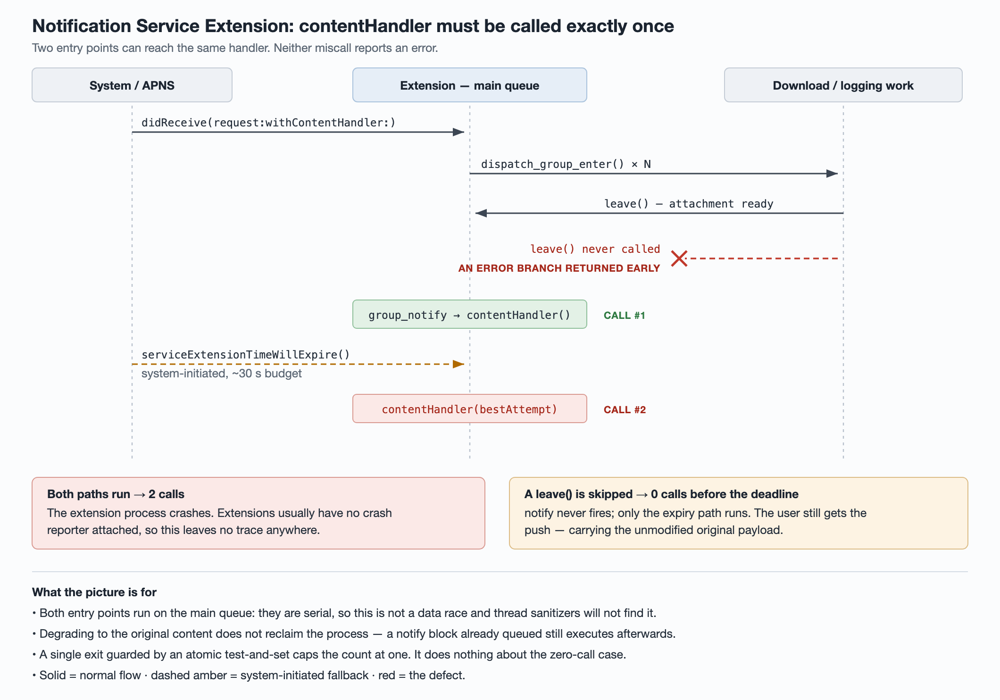

# The notification service extension's contentHandler must be called exactly once

A `UNNotificationServiceExtension` hands you a `contentHandler` block and one rule:
call it once. Both ways of breaking that rule are silent — no exception, no error
return, and nothing in your crash reporter.



| Miscall | Immediate effect | What the user sees |
| --- | --- | --- |
| Called twice | The extension process is killed | The push still arrives, carrying the unmodified original payload |
| Never called | The system waits out the whole time budget | Same — the original payload, after a delay |

Note what is *not* in that table: the notification going missing. The push is
delivered either way. What you lose is everything the extension existed to do —
the image attachment, the text trimmed to the render width, the localized body.
A silent quality regression is much easier to ship than a visible one.

## Why two callers exist in the first place

An extension that downloads anything has two entry points into delivery:

1. the completion of its own work — typically a `dispatch_group_notify` block, and
2. `serviceExtensionTimeWillExpire()`, which the system calls to give you a last
   chance to submit before the budget runs out.

Wire `contentHandler` directly into both and you have two callers of a
call-once API. The instinct is to reach for a lock, which misreads the problem:
both blocks run on the main queue, so they are *serial*. There is no data race
here and a thread sanitizer will never flag it. The two calls simply happen one
after the other.

The reason the second one still happens is the part worth remembering:
**degrading to the original content does not reclaim the process.** The system
delivers the fallback and moves on; a notify block that was already queued runs
afterwards anyway, and calls a handler that has been used up.

## The opposite failure has a duller cause

Zero calls almost never come from forgetting the happy path. They come from an
error branch:

```objc
if (![NSJSONSerialization isValidJSONObject:payload]) {
    return;                       // dispatch_group_leave() never runs
}
```

One skipped `leave()` and the group's count never reaches zero, so `notify`
never fires. The extension then sits there until the expiry path saves it.
This is the same shape as every other early-return-without-callback bug, and it
is why "replace a force-unwrap with `guard … else { return }`" is a refactor that
needs a second look at what the `else` branch owes its caller.

## Five layers, and what each one actually covers

The single most useful thing to hold onto is that "called twice" and "never
called" are *different bugs*, and almost every mechanism you can build covers
one and not the other. Writing the coverage down per direction is what stops you
from shipping one guard and believing you are done.

| # | Layer | Acts at | Stops a duplicate call | Stops a missing call |
| --- | --- | --- | --- | --- |
| 1 | Single exit + atomic test-and-set | runtime | strong | **none** |
| 2 | `-Werror=completion-handler` | compile time | weak — same function only | strong |
| 3 | CI check that the flag is still in the target's settings | pre-merge | protects layer 2, catches neither itself | |
| 4 | Delivery-path reconciliation counter | production | detect only | detect only |
| 5 | Decouple analytics from delivery | design | — | removes the pressure |

Layers 1 and 2 are near-complements: the one that is strong against duplicates
is blind to omissions, and vice versa. That is the reason to build both rather
than picking the cheaper one. Layer 3 exists only because layer 2 can disappear
without a sound. Layers 4 and 5 do not prevent anything — one tells you how
often this is happening, the other reduces how often you are exposed at all.

## Layer 1 — one exit, made single-shot

Collapse every delivery path into one function and guard it with an atomic
test-and-set:

```objc
@property (atomic, copy) void (^contentHandler)(UNNotificationContent *);

// _delivered is _Atomic(bool); the swap returns the previous value.
- (void)deliverOnce:(UNNotificationContent *)content {
    if (atomic_exchange(&_delivered, true)) { return; }
    void (^handler)(UNNotificationContent *) = self.contentHandler;
    self.contentHandler = nil;
    if (handler) { handler(content); }
}
```

Making the property `atomic` matters as much as the flag: the expiry path reads
it on the main queue while download callbacks write it on a session queue.

**This does nothing about the zero-call case.** It guarantees "at most once".
"At least once" is a separate problem needing a separate mechanism, and
conflating the two is how you end up believing you are covered when you are not.

### Make it reusable

The per-class version above is fine when you have one such handler. Once there
are several, wrap the block itself so the guarantee travels with it rather than
being re-implemented — and re-broken — in each class:

```objc
typedef void (^ContentHandler)(UNNotificationContent *);

// Drops the second and later calls; ARC copies the returned block to the heap.
static ContentHandler MakeOnce(ContentHandler handler) {
    __block _Atomic(bool) called = false;
    return ^(UNNotificationContent *content) {
        if (atomic_exchange(&called, true)) { return; }
        handler(content);
    };
}
```

```swift
func once<T>(_ body: @escaping (T) -> Void) -> (T) -> Void {
    let lock = NSLock()
    var done = false
    return { value in
        lock.lock(); let first = !done; done = true; lock.unlock()
        if first { body(value) }
    }
}
```

Wrap once at the boundary — where the system hands you the handler — and every
path downstream is structurally incapable of firing it twice. The `atomic`
property qualifier goes away with the flag it was protecting.

Resist the urge to make the second call trap instead of returning. A duplicate
call is a bug you want to find in review, not a crash you introduce in front of
a user on a path that was previously merely wasteful.

## Layer 2 — what the compiler can and cannot see

Clang's `-Wcompletion-handler` is the cheapest guard available, and it is worth
knowing precisely where its vision ends. Measured on three shapes:

| Shape | Caught? |
| --- | --- |
| Early return without calling the block | yes |
| Two calls in the same function | yes |
| Block stored in a property, called from two other methods | **no** |

That third row is the real-world form of this bug. So treat the flag as strong
protection against *missing* calls and only partial protection against
duplicates — it covers the half you would have caught in review anyway.

Order matters when you turn it on:

```
-Werror=unknown-warning-option -Werror=completion-handler
```

Clang processes `-W` options in the order they appear. The first flag is not
about your code at all — it is about the guard being removed underneath you by
the *toolchain*. If your CI's compiler is not pinned and this warning group is
ever renamed or dropped, an unknown option is silently ignored and the gate
quietly stops existing.

### Two things to do before you enable it repo-wide

**Count the existing hits with a full build.** An incremental build only
re-emits diagnostics for translation units it recompiled, so the number you get
is meaningless. Confirm you actually did a full one by counting compile lines in
the log before you trust the warning count.

In one large UIKit codebase this produced 34 hits — of which none were defects
that could reach a user. Do not modify 30-odd working call sites to turn a flag
on. Enable the permanent gate only on targets whose count is already zero, and
audit the rest by diffing the list over time. When you do diff two audits, the
key is *file + diagnostic + the source line's guard*, never the line number;
resolve an old list against the commit it was taken from.

**Prove the guard is connected with a positive control.** A silently ignored
flag and a working one produce identical build logs — both say the build
succeeded with no diagnostics. Three checks separate them:

1. no "unknown warning option" anywhere in the log,
2. inject a deliberate defect and confirm the build now fails,
3. rename the warning group to something nonexistent and confirm that also fails.

If you are grepping the build settings by hand to confirm a flag is present,
remember that a pattern containing `$(` needs `grep -F`. In a basic regular
expression a mid-pattern `$` is an anchor, so the pattern can never match — and
"flag present, code clean" looks exactly like "flag absent". A zero that means
two different things is not a verification.

## Layer 3 — keep the flag from being deleted

Layer 2 lives in one line of a target's build settings inside the project file.
That line can leave without anyone noticing: a merge resolves against the older
side, someone edits the setting in the IDE, or a dependency manager regenerates
the project. Nothing fails, no one is told, and the next duplicate call ships.

This is a different failure from the toolchain one above, so it needs a
different guard: a pre-merge check that reads the project file and fails when
the target no longer carries the flag. Four things decide whether that check is
real or decorative.

**The checker needs its own self-test, including a negative case.** A test suite
that only feeds it a correct project file cannot distinguish a working checker
from one that reports "all good" unconditionally. The load-bearing case is
"remove the flag, the checker must fail".

**Three exit states, not two.** Pass, fail, and could-not-determine. A checker
that returns success because it could not find or parse its input is worse than
no checker, because it also stops anyone from looking.

**Hang it off a job that can actually fail.** Some CI jobs are structurally
incapable of failing — they write reports and always exit zero. A gate attached
to one of those is green forever. And a job filtered by changed paths is skipped
rather than passed, so marking it required makes filtered changes wait on a
check that will never run.

**If it emits annotations, verify through the annotations API, not the log.**
The text is in the log either way, so reading the log cannot tell you whether
the annotation was actually produced.

One more trap when relaxing the pattern the checker matches: under a
dot-matches-newline flag, `.` crosses configuration boundaries and will happily
credit one target's flag to the next one. Exclude newlines explicitly rather
than reaching for the permissive wildcard.

## Layer 4 — find out how often it happens

Extensions get no crash reporting for free. If your crash SDK is initialized in
the app delegate, it is not running in the extension — a separate process that
links its own, usually smaller, set of dependencies. For any extension bug,
"nothing in the crash reporter" carries no information at all.

Deciding whether this is rare or constant needs a counter you wrote yourself:
mark progress in storage shared by the extension and the app — entered, took the
notify path, took the expiry path — and report it on the next app launch. Expect
a lower bound, not a measurement: concurrent extension instances lose
increments, and users who never open the app never report anything. It is still
the only number that tells you whether layer 5 is worth building.

## Layer 5 — stop crowding the deadline

Nothing above shortens the work the extension does. If the critical path
serializes an image download behind a network log with its own generous timeout,
the two together can exceed the budget, and every layer so far only converts
"crash" into "safe degradation". Taking analytics off the delivery path is the
change that actually reduces how often you reach the ceiling.

## Detecting a *missing* call: the layer worth not building

Everything above caps the count at one. None of it can tell you the handler was
never called at all, and the obvious generic answer — a wrapper that asserts in
`dealloc` when it was never invoked — does not work in an extension, for two
independent reasons: a missed call is masked by the timeout path anyway, and
`dealloc` does not run when the process is killed.

The distinction is worth keeping straight, because both mechanisms are "a
one-shot wrapper" and they solve opposite halves of the problem:

| Wrapper | Guarantees | Fails in an extension? |
| --- | --- | --- |
| Swallow the second call | at most once | no — this is the reusable Layer 1 above |
| Assert in `dealloc` if never called | detects at least once | yes — the process is killed, `dealloc` never runs |

The detecting variant is worth building for your app process, where deallocation
is normal. Build the consumer of its signal first, or you have added a reporter
with no reader.

## References

- [UNNotificationServiceExtension](https://developer.apple.com/documentation/usernotifications/unnotificationserviceextension)
  — documents both the expiry callback and the original-content fallback. It also
  states that silent notifications never reach an extension, which is why
  anything about revoking them belongs to the app process instead.
