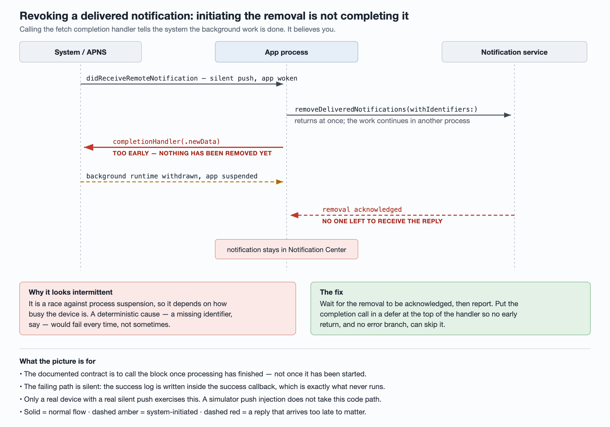

# Revoking a delivered notification: initiating the removal is not completing it

A push arrives telling the app to withdraw a notification it delivered earlier.
The app wakes in the background, asks the system to remove it, and reports that
it is done. Sometimes the notification stays in Notification Center anyway.



The bug is in the last two lines of the handler:

```swift
func application(_ app: UIApplication,
                 didReceiveRemoteNotification payload: [AnyHashable: Any],
                 fetchCompletionHandler completion: @escaping (UIBackgroundFetchResult) -> Void) {
    center.removeDeliveredNotifications(withIdentifiers: ids)
    completion(.newData)
}
```

Calling the completion handler is a statement to the system: *the background
work is finished.* The system believes it and stops granting runtime. But the
removal is cross-process — it has been handed to the notification daemon and
nothing has happened yet. When the daemon gets around to it, the app that asked
may already be suspended.

Apple's contract for this delegate method is explicit that you call the block
once you have finished processing, and that failing to call it gets your app
terminated. It is easy to read that as "call it, and call it promptly", and miss
that promptly still means *after*. **Initiating is not completing.**

## Why this lives in the app, not the extension

A notification service extension can rewrite a notification before it is shown,
so it is a natural first guess for the place to withdraw one. It is the wrong
guess: the system never runs an extension for a silent push, and a push whose
only job is to retract an earlier notification is exactly that — silent, with
nothing to display.

So the whole revoke path belongs to the app process, woken in the background,
and it inherits that context's constraints: a short slice of runtime, revocable
at any moment, ended by the very handler this article is about.

## The removal API gives you nothing to wait on

`removeDeliveredNotifications(withIdentifiers:)` returns `Void`. There is no
completion handler to hook, which is exactly why this code gets written.

The handle you do have is that requests you send to the same notification center
are serviced in order. Issue a read after the removal and report from *its*
callback:

```swift
center.removeDeliveredNotifications(withIdentifiers: ids)
// The read is serviced after the removal, so its callback is our "done".
center.getDeliveredNotifications { _ in completion(.newData) }
```

Be honest with yourself about what this is: request ordering on one center is
not a documented guarantee, it is the only lever the API exposes. It is still
strictly better than reporting before anything has happened.

## Report on every exit, exactly once

Once a completion call sits behind an async callback, every early return becomes
a path that never reports — and not reporting gets the app killed. Put the call
somewhere no return path can skip:

```swift
var reported = false
// Reported on every exit, including the guard failures below.
defer { if !reported { reported = true; completion(.noData) } }
```

In Objective-C, where there is no `defer`, the equivalent is a one-shot block
created at the top of the method and invoked from each branch. Either way, write
it before you write the branches, not after.

## Why it looks intermittent — and why that is a clue

A deterministic cause cannot explain "sometimes". If the identifier used for
matching were simply wrong, or a required field were missing from the payload,
the removal would fail *every* time. The symptom being occasional is itself
evidence that the cause is a race against process suspension, which is why it
tracks how busy the device is.

This cuts both ways as a diagnostic rule. When you have a deterministic
candidate and an intermittent symptom, you have not found the cause yet — you
have found a second bug worth fixing on its own schedule.

That second bug has a recognisable shape, and it is worth going to look for it
once you have stopped treating it as the cause. The matching code requires more
fields to line up than the protocol actually guarantees: one identifier is
genuinely part of the contract, a second exists only because someone put it in a
log dictionary, and the code demands both before it will act. Two questions
settle whether the extra requirement is protection or superstition — is that
field required anywhere except in your own matching code, and does the other
platform's client revoke successfully without it? If it does, your admission
criteria are stricter than the contract, which is not the same thing as safer.

## The failure path has no logs, by construction

Look at where the success log lives in code like this: inside the success
callback. Which is precisely the thing that never runs. So the failing case
writes nothing at all, and "no errors in the logs" is not evidence of anything.

Before you can attribute anything, add the missing signal:

- an event on the skipped path, carrying a *reason* — so a missing identifier and
  a suspended process are distinguishable rather than pooled;
- a counter for successful removals, so the two can be compared per user.

Getting the event registered in whatever pipeline you use is a prerequisite, not
a detail. Until it is live, an empty query result and a working feature look
identical.

## Verifying it needs a real device

None of this reproduces in a simulator. Injecting a push locally does not take
the same code path as a real silent push routed through APNS and delivered to a
backgrounded app. Two preconditions bite before the code even runs, and both
have wasted retests:

- Background App Refresh must be enabled.
- The app must not have been force-quit — a swiped-away app is not woken at all.

If either is off, a correct fix still leaves the notification sitting there, and
you will conclude the fix does not work.

## Reading the A/B result

Ship the fix behind a flag and compare the per-user count of successful removals
between arms.

- **Treatment higher than control** — the race was real and the fix works.
- **Arms flat** — the premise is wrong, and the next question is whether the app
  is being woken at all. Force-quit apps, Background App Refresh disabled, and
  the system's own budget for silent pushes all produce "the app never ran",
  which no amount of handler discipline will fix.

Two things about the rollout itself, before you read anything into the first
day. Scope the flag to the platform and to a minimum client version that
actually contains the fix — otherwise the treatment arm is diluted with builds
that could not behave differently no matter which arm they are in. And know your
flag's snapshot semantics: a value cached for the lifetime of a session is read
one session late, so on the day you start the rollout the treatment arm is
legitimately empty. **A zero on day one is the expected reading, not evidence of
a misconfigured flag.** Roll back on it and you have reverted a rollout that was
working.

Keep the honest label on the diagnosis until that data lands. The mechanism here
is derived from code order plus a documented contract, which makes it the best
available explanation — not a confirmed one. The failing path left no evidence
behind, so there is nothing yet that ties the production symptom to this
mechanism specifically. Write "unconfirmed" down where the next person will see
it, and write down what would falsify it.

## References

- [`application(_:didReceiveRemoteNotification:fetchCompletionHandler:)`](https://developer.apple.com/documentation/uikit/uiapplicationdelegate/application(_:didreceiveremotenotification:fetchcompletionhandler:))
- [`UNUserNotificationCenter.removeDeliveredNotifications(withIdentifiers:)`](https://developer.apple.com/documentation/usernotifications/unusernotificationcenter/removedeliverednotifications(withidentifiers:))
