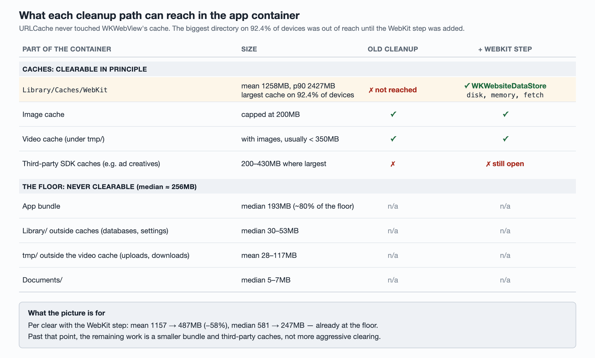

# "Clear cache" didn't clear the biggest cache: WKWebView's disk cache

An iOS app offered a "Clear cache" button on the screen users see when they go
to cancel or uninstall. Users tapped it and the app's footprint barely moved.
The cleanup emptied the image cache and the video cache. The largest cache on
almost every device belonged to `WKWebView`, and nothing in the app ever
cleared it.

This article covers the fix, how it was measured, what it freed (about 58% of
the app's footprint per clear), and what can't be freed at all. It is part of a
series; [Measure before you shrink](measuring-storage-by-directory.md) covers the
per-directory metric that pointed here.



## 1. The cache that nothing cleared

The fleet-wide per-directory breakdown showed:

- `Library/Caches/WebKit` was the **largest cache directory on 92.4% of
  devices**;
- its mean size was **1258MB** and its p90 **2427MB**.

The existing cleanup emptied the image cache, which is capped at 200MB, and the
video cache. Those two together were typically under 350MB.

The reason WebKit was missed: `URLCache.shared.removeAllCachedResponses()` clears
the **app process's** URL cache. `WKWebView` loads through WebKit's own
networking process, and its caches belong to a `WKWebsiteDataStore`. Clearing
`URLCache` never reaches them.

## 2. The change: clear caches, not website data

```swift
// Caches only: cookies, localStorage and IndexedDB hold web sign-in state.
let types: Set<String> = [
    WKWebsiteDataTypeDiskCache,
    WKWebsiteDataTypeMemoryCache,
    WKWebsiteDataTypeFetchCache,
]
WKWebsiteDataStore.default().removeData(ofTypes: types,
                                        modifiedSince: .distantPast) {
    // report completion
}
```

The obvious shortcut is `WKWebsiteDataStore.allWebsiteDataTypes()`. That would
also wipe cookies, `localStorage` and IndexedDB. In-app web features kept their
sign-in state there, so the shortcut would have signed users out of them. A unit
test pins the exact set of types, so a later "simplification" fails in CI
instead of in production.

## 3. Rolling it out so the effect could be measured

The rollout used two flags:

| Flag | What it does |
| --- | --- |
| Measurement | Before clearing, walk the container and attach the app size to the tap event; afterwards, send a "clear done" event with the new size. The difference is the bytes freed. |
| WebKit clearing | Adds the `removeData` call above to the cleanup. |

The control arm had **measurement on and WebKit clearing off**. That turns
control vs. treatment into a direct measurement of what WebKit clearing alone
frees. If you ship a measurement flag together with a behaviour flag, turn the
measurement on in control too.

There were about 90 clears a day across the app. Over 30 days, 447 of them
carried the storage measurement.

## 4. Results

Arms with both flags on, last 30 days:

| App size | Before clearing (n=447) | After clearing (n=341) | Freed |
| --- | --- | --- | --- |
| Mean | 1157MB | 487MB | 670MB (58%) |
| Median | 581MB | 247MB | 334MB (57%) |

There were 0 cleanup failures and 3 timeouts in 30 days.

## 5. The floor nothing can clear

After clearing, the median device still held 247MB. To see what that is, the
breakdown was sampled across a few hundred thousand devices. The ranges below
are for devices under and over 1000MB in total.

| Part of the container | Size | Clearable? |
| --- | --- | --- |
| App bundle | median 193MB | No: it is the app itself |
| `Library/` excluding caches (databases, settings) | median 30–53MB | No: deleting it loses data |
| `tmp/` excluding the video cache | mean 28–117MB | No: in-progress uploads and download temp files |
| `Documents/` | median 5–7MB | No |
| **Floor** | **median ~256MB** | |

What that means:

- **The median user is already at the floor**, and about 80% of the floor is the
  bundle. Lowering their footprint further means shipping a smaller binary;
  clearing more caches won't help.
- **The mean user ends about 190MB above the floor**, roughly 80% of their
  clearable bytes removed. The best candidate for the rest is third-party SDK
  caches the cleanup doesn't reach. Earlier breakdowns showed ad SDKs' creative
  caches averaging 200–430MB on devices where one of them was the largest
  directory. Whether WebKit is left fully empty after clearing hasn't been
  measured.

## 6. A rollout trap: the experiment expires before old builds do

Once the effect was confirmed, the flags went to 95% of users, and new builds
hard-code both behaviours on. That second step matters. Older builds still read
the flags from the experiment, so when the experiment expires they fall back to
the default, which is **off**. Their Clear cache button goes back to missing
WebKit without any code change.

Keep the experiment, or a permanent 100% config, alive until builds that read
the flag make up a negligible share of users.

## 7. How sure each claim is

All the numbers are reported by the client.

| Claim | Strength | Why |
| --- | --- | --- |
| The two flags behave as described | Confirmed | Read from the code |
| WebKit clearing added no failures | Confirmed | 0 failures, 3 timeouts in 30 days |
| A clear frees ~670MB (~58%) on average | Best explanation, unconfirmed | "Before" and "after" are means of two sets of rows, not paired by device, and there are only 76% as many "after" rows |
| Most of what is freed is WebKit | Best explanation, unconfirmed | Image + video caches together are usually under 350MB; the control-vs-treatment split hasn't been run yet |
| The floor is ~256MB, ~80% of it the bundle | Best explanation, unconfirmed | Taken from a fleet-wide sample, and users who clear may not look like the fleet |
| The mean user's ~190MB above the floor is third-party SDK caches | Best explanation, unconfirmed | Based on an earlier directory distribution; WebKit residue after clearing not measured |
| Clearing WebKit doesn't sign anyone out | Best explanation, unconfirmed | The scope is pinned by a test and excludes cookies, but no production signal tracks unexpected sign-outs |

## 8. Still open

- Compare control with treatment to isolate how much WebKit clearing alone frees.
- Pair before/after rows by device instead of comparing means.
- Measure whether anything remains in WebKit's cache after clearing.
- Decide whether third-party SDK caches can be cleared safely. They belong to
  the SDKs, so check each one's documented API before deleting anything behind
  its back.

## Takeaways

- `URLCache` is not the web view's cache. If your app embeds `WKWebView`, its
  disk cache is probably your largest one; clear it through
  `WKWebsiteDataStore`.
- Name the data types you clear, and pin them with a test. "All website data"
  includes sign-in state.
- Measure before and after in the same flow, and keep measurement on in the
  control arm.
- Know your floor. Past a point, footprint is bundle size, and that is a
  different project.
- When you hard-code a flag on, remember that old builds still read it. Don't let
  the experiment expire underneath them.
