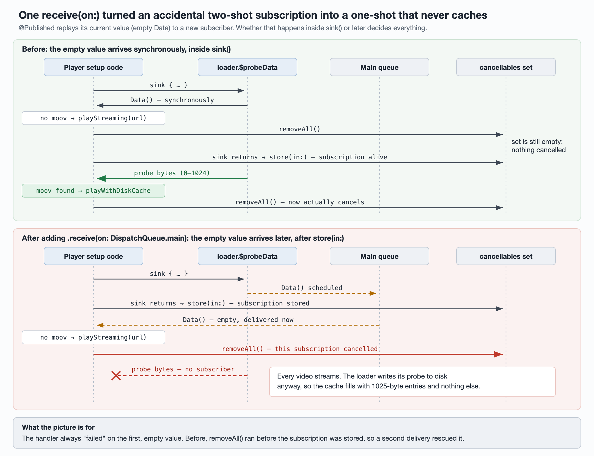

# A one-line `receive(on:)` that silently disabled a video cache for nine months

An iOS app was getting complaints about storage. The plan was to cut its video
disk cache cap from 1000MB and add time-based expiry, and a ticket named the
cache as "the main driver" of the complaints. Nobody had measured it. When
someone did, the cache held almost nothing, and it had held almost nothing for
nine months.

This is how a one-line threading fix turned a Combine subscription that worked
by accident into one that never worked, and why nobody noticed. It is part of a
series on app storage; the first article,
[Measure before you shrink](measuring-storage-by-directory.md), covers the
metric that exposed it.



## 1. What the cache actually contained

After three days of real use on a test device, the video cache directory had:

- 31 entries, **every one exactly 1025 bytes**, 132KB in total;
- 0.3% of the app container.

The median video on the platform was about 2.4MB, so a working cache holding
those 31 videos should have been around 75MB. And 1025 bytes is no arbitrary
size: it is the byte range `0–1024`, the probe request described below. The cache
held no complete video at all.

A bytes-only metric would have rounded this to 0MB and called the cache healthy.
The file count is what gave it away.

## 2. The probe

Before choosing how to play an MP4, the player fetched its first 1024 bytes and
looked for the `moov` atom. If `moov` was at the front, the file could play
progressively from a caching resource loader that wrote to disk. If not, it fell
back to a plain `AVURLAsset` that streamed without any disk cache.

Simplified, the code looked like this after the change:

```swift
let loader = RangeLoader(url: url)
loader.$probeData                         // @Published var probeData = Data()
    .receive(on: DispatchQueue.main)       // the one-line change
    .sink { [weak self] data in
        guard let self else { return }
        if self.hasMoovAtFront(data) {
            self.playWithDiskCache(url)
        } else {
            self.playStreaming(url)
        }
        self.cancellables.removeAll()      // meant as one-shot
    }
    .store(in: &cancellables)
loader.fetch(upTo: 1024)
```

The commit was titled "fix crash" and changed only that line. `git log -L` on
the line pinned the last good build and the first bad one.

## 3. Why it worked before, and why it stopped

`@Published` replays its current value to a new subscriber **synchronously,
inside the call to `sink`**. The current value was an empty `Data()`.

**Before the change:**

1. `sink` runs the closure immediately with empty data. The `moov` check fails,
   so the player starts streaming, and `removeAll()` runs.
2. But `sink` hasn't returned yet, so its `AnyCancellable` isn't in the set.
   `removeAll()` doesn't touch this subscription.
3. `sink` returns and `store(in:)` inserts the subscription. It is alive.
4. The probe's bytes arrive. The closure runs again, finds `moov`, and switches
   to the caching path. Now `removeAll()` really does cancel.

The closure was meant to run once, but it actually ran twice, and the second run
did the useful work. The code worked by accident.

**After adding `receive(on: .main)`:**

1. `sink` *schedules* the empty value onto the main queue and returns at once.
   `store(in:)` inserts the subscription.
2. The main queue delivers the empty data. The `moov` check fails, the player
   starts streaming, and `removeAll()` runs. This time the subscription is in
   the set, so it is cancelled.
3. The probe's bytes arrive with no subscriber left. The caching path is never
   taken.

The loader's write-to-cache flag was hard-coded on, so each probe still wrote
its 1025 bytes to disk. Every video left exactly one 1025-byte entry and nothing
else.

`removeAll()` has a second problem: it cancels **every** subscription in the
player's set, not just this one.

## 4. Why nine months went by

- **The fallback worked.** Streaming played every video, so users saw nothing
  wrong and no crash or error fired.
- **The module had no telemetry.** Nothing recorded whether playback took the
  cache path or the fallback path. A cache hit rate of 0% would have been
  noticed in a day.
- **The diff looked harmless.** Adding `receive(on:)` reads like a change of
  thread, but it changes **when** values arrive, synchronous or asynchronous,
  and the code depended on that timing.

## 5. What else the cache was doing wrong

Once the cache was actually examined, more defects surfaced:

- **Probes pollute the cache.** Because caching was hard-coded on in the loader,
  a 1024-byte probe registered metadata and wrote an entry. When `moov` was not
  at the front, the video never used the cache, but its entry stayed anyway.
- **Accounting drifts in three ways.**
  - When eviction's `removeItem` failed, an early return skipped the accounting
    update.
  - On restart, the total was rebuilt from the lengths recorded in metadata,
    not from the size on disk. A metadata write-coalescing window added earlier
    made this worse.
  - Eviction excluded only the file this loader was writing. A file being
    written by another loader could be deleted, and that loader's later appends
    were silently dropped.

  Two of the 31 entries already recorded 2050 bytes for files that held 1025
  on disk, a 2× overcount that can be reproduced today.

## 6. Fix it or delete it, and why history couldn't decide

Deciding whether the cache was worth reviving needs to know what it was worth
when it worked. That data was from before the break, and the warehouse
partitions for that period turned out to be unreadable, with no pre-aggregated
copy. History could not answer the question.

That left one option: revive the cache behind a **default-off** experiment and
measure it in production. Reviving it is a storage regression, from almost
nothing to up to 1GB per device, so it has to ship together with a lower cap
and the accounting fixes, not before them.

The finding also changed the value of earlier work. A previous fix had reduced
write amplification in this cache's metadata. It was correct, but the path it
optimized had barely been running in production.

## Takeaways

**In Combine:**

- Treat a `@Published` property's initial value as a real event. Use
  `dropFirst()`, filter out the placeholder, or model a one-shot result as a
  `Future` or a `PassthroughSubject` instead.
- Don't build "one-shot" behaviour on when a cancellable gets stored. Use
  `first(where:)` and let the publisher complete, or keep that one
  `AnyCancellable` in its own property and cancel only that one.
- Review any change that adds or removes `receive(on:)` as a logic change.
  Synchronous delivery becoming asynchronous can reorder side effects.

**For caches in general:**

- Before you tune a cache's cap, check that the cache contains what you think it
  does. File counts and entry sizes are cheaper to collect than an argument.
- A silent fallback hides the death of the primary path. Count which path each
  request took.
