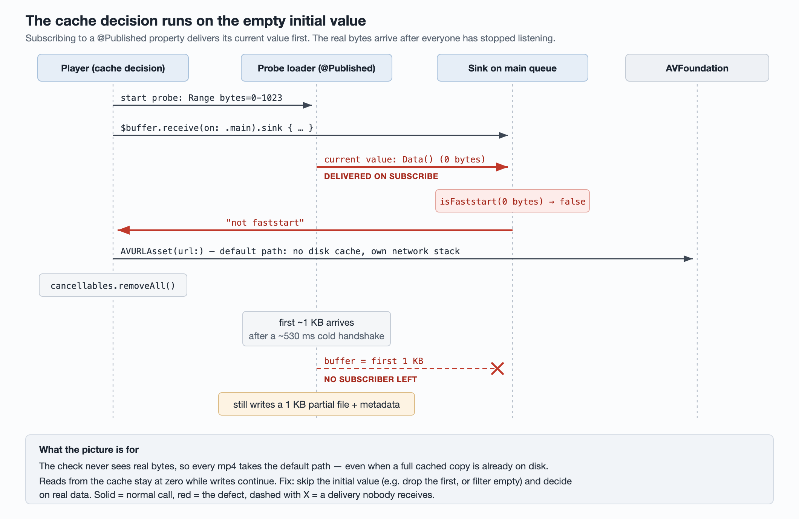
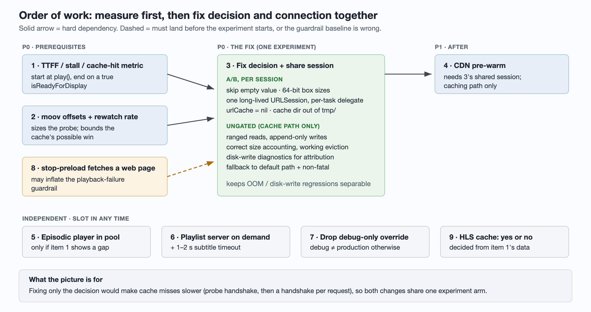

# Tech design: fixing slow video start on iOS — disk cache, connection reuse and a real first-frame metric

Video start on our iOS client was slow, and most of it traced back to a single
wrong decision in the player: a check that is supposed to choose between "play
through the disk cache" and "hand the URL straight to AVFoundation" always chose
the second. Every video skipped the local cache, and with it the code path that
was meant to reuse connections. Nothing alarmed, because the metric we had could
not see it.

This is the plan to fix it. It is a plan, not a post-mortem: the bug and its
mechanism are confirmed, the fixes are not yet built. The interesting part is
less the bug than everything that has to happen around a "one-line fix" before
it is safe to ship.

## Summary

- **Problem 1 — the disk cache is never read.** A Combine subscription receives
  the empty initial value of a `@Published` buffer, decides "not faststart",
  and unsubscribes before the real bytes arrive. A video watched yesterday is
  downloaded again today.
- **Problem 2 — every request opens a new connection.** The caching path
  creates a fresh `URLSession` per request, so each one pays DNS + TCP + TLS:
  about 530 ms cold, 1.2–1.6 s on a congested network.
- **Problem 3 — no metric could have caught either.** There was no true
  time-to-first-frame (TTFF), no stall count and no cache-hit dimension, so a
  cache that had been dead for about a year looked like any other year.

The fix runs in three steps: instrument first, then fix the cache decision and
the connection handling **together, in one experiment arm**, then pre-warm the
CDN and reuse players on the episodic-series surface.

## 1. What is wrong

| # | Defect | What users get | Confidence |
| --- | --- | --- | --- |
| 1 | The faststart check subscribes to a `@Published` buffer, receives its empty initial value, returns "not faststart" and cancels the subscription | No CDN mp4 is ever played through the disk cache. On a dev device TTFF was 1165–2216 ms; a cache hit should be 190–212 ms | Confirmed in code and on-device logs (probe saw `bytes=0`); production distribution not yet measured |
| 2 | The loader behind the caching path builds a new `URLSession` for every request | Every request on the caching path re-handshakes: ~530 ms to first response, 1.2–1.6 s when congested | Confirmed in code and on-device logs |
| 3 | The existing load-time metric starts at `play()` and ends at the `.playing` state, not at first frame on screen, and goes only to the in-house warehouse | Nothing comparable to the Android client's TTFF; the dead cache raised no alarm for a year | Confirmed in code |

### Mechanism of problem 1

To decide whether a file can be streamed through the cache, the player fetches
the first ~1 KB and looks for a `moov` box ahead of `mdat`. The bytes arrive
through `@Published var buffer = Data()`. Subscribing to a `@Published`
property **delivers its current value immediately** — here, an empty `Data`.
The sink is behind `receive(on: .main)`, so that empty value is first in line.
The check runs on zero bytes, returns false, the player builds a plain
`AVURLAsset`, and then removes all its cancellables. When the real kilobyte
arrives a few hundred milliseconds later, nobody is listening.

It does this even when a complete cached copy is already on disk. The
regression came in with a refactor about a year before it was found.

**The cache was still being written.** The probe goes through the same loader,
and that loader has its file cache hard-wired on. Every video therefore leaves
a metadata record and a ~1 KB partial file in the cache directory. Reads have
been zero for a year; writes never stopped. Those leftovers have to be dealt
with before the fixed path ships (see 3.3).

### Mechanism of problem 2

Each fetch calls `finishTasksAndInvalidate()` on the previous session and
creates a new one. A new session has an empty connection pool, so every request
does DNS, TCP and TLS from scratch. The session also sets
`requestCachePolicy = .reloadIgnoringLocalAndRemoteCacheData`, which turns off
URL-level cache *reads*.

Today this hurts less than it sounds: because of problem 1, the default path
uses `AVURLAsset`, which runs on AVFoundation's own network stack and never
touches this loader. Problem 2 only bites on the caching path — which is
exactly the path that fixing problem 1 turns on.

### Mechanism of problem 3

Videos are preloaded before the user reaches them, so by the time `play()` is
called the player is often already warm. Starting the clock at `play()` misses
the preload, and ending it at `.playing` rather than at first frame on screen
measures the wrong event. Auto-advance in Picture in Picture deliberately does
not report the metric at all.

## 2. The plan

| Priority | Item | Solves | Gating |
| --- | --- | --- | --- |
| P0 | 1 · TTFF, stall and cache-hit instrumentation | Problem 3. Without it no later item can be judged | None (logging), with a sampling-rate kill switch |
| P0 | 2 · Measure `moov` position across transcoded files, and the rewatch rate | Sizes the probe, decides whether to split by content type, bounds the cache's possible win | No code |
| P0 | 3 · Fix the cache decision + share one `URLSession` + rework the cache path's memory and disk writes | Problems 1 and 2 | A/B, default off (gates only decision and connection — see 3.3) |
| P1 | 4 · CDN pre-warm | First caching-path video after a cold launch still pays a cold handshake | A/B (extra arm on item 3, or separately after it ramps) |
| P1 | 5 · Put the episodic player into the shared player pool | That surface creates a new player per episode; its "preload" call does not preload | A/B |
| P1 | 6 · Start the local playlist server on demand, time out subtitle fetches | A local HTTP server runs for every user; a slow subtitle request stalls video | Kill switch, default on |
| P1 | 7 · Remove a debug-only "always true" flag override | Debug builds behave differently from production | None |
| P1 | 8 · Stop "stop preloading" from fetching a real web page | Every stop issues a real request and a playback failure, possibly inflating the failure metric | Kill switch, default on |
| P2 | 9 · Decide whether HLS gets a client cache (write-up) | The HLS surfaces have no client cache by design | No code |

Items 1 and 2 run in parallel; item 3 waits for both. Item 1's start point has
to be settled before anything ships, or item 3's experiment has nothing valid
to read. Item 4 needs item 3's shared session. Item 8 has to be investigated and
handled before item 3's experiment starts, or the playback-failure guardrail
starts from a skewed baseline. Items 5–7 are independent and can slot in
anywhere.

Architectural cleanup — splitting PiP out of the player controller, merging the
two near-duplicate vertical-feed implementations, moving ad slots out of the
video module — is deliberately out of scope.

## 3. Items in detail

### 3.1 TTFF, stall and cache-hit instrumentation

**Problem.** There is no true TTFF, and no way to tell whether a given play went
through the cache or the network. The cache was broken for a year and no metric
moved.

**The start point cannot live in the player's `setup(url:)`.** When a
preloaded video is played, the controller sees the URL is unchanged and does not
assign it again, so `setup(url:)` is never called. Preload already assigned it
earlier, so asset loading *and* first frame both happened during preload.
Timing from `setup` would measure the preload on every swiping surface and emit
nothing at the moment the user actually sees the frame.

**Changes.**

1. **Start**: the timestamp the controller already records in `play()`, which
   distinguishes preload from play.
2. **End**: the `isReadyForDisplay` observer currently ignores the new value
   and also fires when it flips back to false; add a guard on the value. If the
   layer was already ready when `play()` ran (preload hit), end = start and tag
   `prewarmed=true`.
3. **Stalls**: count `AVPlayerItemPlaybackStalled`, accumulate count and total
   duration per play, report at end of play.
4. **Dimensions**: `path` (caching / default / hls / local_m3u8), `cache_hit`
   (hit / partial / miss), `prewarmed`, `surface`, `network`.
5. **PiP auto-advance**: keep not reporting it, and document that it is
   outside the denominator.
6. **Channel**: send to both the product-analytics tool and the warehouse, with
   field names matching the Android client's TTFF event, so the two platforms
   can sit on one chart. Play start is a foreground user action, so sending it
   to product analytics cannot pull background-woken devices into DAU.

**Denominator**: one event per user-initiated play, excluding PiP
auto-advance. Check daily play volume before launch and set the sampling rate
from it.

**Expected first reading**: `path=default` should be close to 100% of CDN mp4
plays. That single number both proves problem 1 exists in production and
becomes the control baseline for item 3.

### 3.2 Where is `moov`, and how often do people rewatch?

**Problem.** How many bytes the probe needs, and whether it should depend on
content type, depends on where `moov` sits in our transcoded files. How much a
disk cache can possibly save depends on how often the same user replays the
same video. Neither is known.

**Do.**

1. Sample a few hundred production mp4s from the feeds, parse the top-level
   boxes, and record `moov`'s byte offset and whether it precedes `mdat`.
   Do **not** just ask "is `moov` in the first 1 KB": with a large `ftyp`,
   `free` or `uuid` box, a perfectly faststart file can have `moov` after
   1 KB, and a 1 KB test undercounts faststart. Split by content type
   (editorial, user-generated, ads).
2. From the warehouse: second-and-later plays of the same item by the same
   user, as a share of all plays, split by surface.
3. Ask the backend / transcoding team which content types are served as HLS
   and which as mp4.

**How the answers are used.** The offset distribution sets the probe size
(cover P99). If non-faststart files cluster in one content type, that type goes
straight to the default path. If the rewatch rate is low, item 3's expected win
shifts from cache hits to connection reuse.

**Why the probe stays.** The caching path downloads strictly from the start of
the file and can only answer AVFoundation's range requests from contiguous
bytes it already has. A non-faststart file on that path cannot show a frame
until the whole file is down, because `moov` is at the end. "Close to 100%
faststart" in a sample is not 100%, so the check is kept.

### 3.3 Fix the decision, share the session, rework the cache path

**Problem.** Problems 1 and 2.

**Why this is not a one-line fix.** The caching path has not run end-to-end in
production for a year. Turning it on exposes all of this:

1. **Whole files in memory.** The loader keeps the entire video in a `Data`
   buffer, and a cache hit reads the whole file with `readToEnd()`. The player
   pool holds up to 8 instances. Memory climbs, and the app risks being killed.
2. **Quadratic work.** The resource-loader delegate reprocesses the whole
   buffer on every chunk, and the file writer truncates and rewrites the whole
   file on every write.
3. **Inflated size accounting.** The writer reports the full buffer length on
   each write and the cache index *adds* it each time. A file rewritten N times
   is counted roughly N times its size, so eviction kicks in early.
4. **Eviction that may never run.** The eviction pass rebuilds file URLs with
   `URL(string:)`. For a path containing characters that need escaping it
   returns nil and the whole pass is skipped. With real GB-scale writes, storage
   would grow without bound.
5. **Write volume jumps from ~1 KB per video to GB scale** (1000 MB LRU).
   Two different numbers matter here. MetricKit's logical-writes figure counts
   bytes written; iOS's disk-write exception (around 1 GB in 24 hours) counts
   *dirtied file pages*, so rewriting the same page counts again. Neither equals
   net bytes on disk. Baseline: 1.9% of device-days already exceed 1 GB of
   logical writes per day (median 42 MB, P99 1.5 GB).
6. **The 1 KB leftovers.** Their metadata records the full video length but
   the file holds 1 KB, so the caching path would estimate buffered duration
   from a truncated file.
7. **The cache directory is in `tmp/`**, which the system can purge at any
   time, pushing the hit rate down.
8. **Fixing only the decision makes misses slower.** On a miss, the player
   would wait for the probe (cold handshake, ~530 ms) before creating the
   asset, and then every caching-path request would cold-handshake again.
   Today it creates an `AVURLAsset` immediately. That is why the decision fix
   and the connection fix share one experiment arm.

**Changes.**

1. **Decision** (A/B). Skip the empty initial value and decide on real bytes;
   size the probe from item 2's offset distribution. Fix 64-bit boxes in the
   box walker too: when `size == 1`, the real size is the following 8 bytes, but
   the current code advances the offset by 1 and misparses every box after it.
   Remember the decision per URL; if a cached file already exists, go straight
   to the caching path. Hand the probe's bytes to the caching player item so
   they are not fetched twice.
2. **Connection** (A/B). One process-lifetime session for the loader. Route
   callbacks with iOS 15's per-task delegate — set `task.delegate` after
   `dataTask(with:)` — instead of a hand-maintained `taskIdentifier` map; the
   deployment target is iOS 15, so it is available. Implement
   `urlSession(_:task:didFinishCollecting:)` and log, from
   `URLSessionTaskMetrics.transactionMetrics`, `isReusedConnection`,
   `networkProtocolName` and the handshake time, for on-device verification.
3. **Don't double-write through the system URL cache** (A/B, with the
   connection change). Set `urlCache = nil` on the shared configuration.
   Nothing in the player sets it today, so the default configuration uses the
   shared `URLCache`, and `.reloadIgnoringLocalAndRemoteCacheData` only
   controls *reads* — responses may still be written into `Cache.db` alongside
   our own cache file. In one disk-write report from an internal device (n=1),
   `Cache.db` was 31% of writes. Whether 206 partial responses are actually
   stored is unverified; check it first.
4. **Cache directory** (A/B). The treatment arm moves to a new versioned
   directory under `Caches/`. That sidesteps the 1 KB leftovers and is purged
   far less aggressively than `tmp/`. The old directory is deleted when the
   treatment arm starts.
5. **Memory and writes** (not gated). Stop holding the whole file: serve each
   range request with an offset/length read from the file; append-only writes;
   count size by bytes actually written; rebuild eviction URLs with
   `URL(fileURLWithPath:)`. This code runs only on the caching path and has no
   effect on today's default path, so it ships ungated — which means an OOM or
   disk-write regression in the experiment can be attributed separately from the
   decision and connection changes. It is not small: the whole chain from the
   buffer subscription through range fulfilment, bytes-per-second estimation,
   cached-duration and stall handling gets rewritten.
6. **Disk-write attribution** (not gated, ships before the experiment). The
   MetricKit reporter only subscribes to daily metrics, which say *how much* was
   written but not *by whom*. Subscribe to `MXDiagnosticPayload` and report the
   top frames of `diskWriteExceptionDiagnostics`, as the attribution source for
   the disk-write guardrail.
7. **Fallback.** Any caching-path error falls back to the default asset and
   reports a non-fatal to the crash reporter, de-duplicated per reason per
   process. No `assertionFailure`: 4xx/5xx, a full disk or a purged file are
   normal events, and an assertion would make internal builds trip on every
   network blip.
8. **HTTP/3** (observe first, no code). The video CDN advertises HTTP/3
   (`alt-svc: h3=":443"; ma=86400` in a `curl -I`); our API hosts do not. Since
   iOS 15, `URLSession` attempts the upgrade after seeing `alt-svc`. With a new
   session per request that hint is presumably never retained, so everything
   stays on HTTP/2 — the best explanation, unconfirmed. Once the session is
   shared, check `networkProtocolName` for `h3`; if it appears, consider
   `assumesHTTP3Capable = true` so the first request uses QUIC too.
9. **While we're here.** Remove a `print` in the loader that also runs in
   release builds and logs request headers containing the user id.

**Gating.** A new A/B flag evaluated once per session: switching mid-session
would leave players half on the old path and half on the new one, so the flag
requires a restart and has a matching debug override. The flag reads false
when the server sends no value, so default-off is free — but it also means the
experiment silently does nothing until the server config is in place before
ramping. With the flag off, behaviour must be identical to before, line for line.

**Unit tests.** The faststart check (empty data, truncated data, `moov` first,
`moov` last, 64-bit box), per-task delegate routing, ranged file reads, size
accounting, the eviction path. Plus one mutation check: revert "skip the empty
value" and the tests must fail.

**Device-only.** Connection reuse on a real network and peak memory with 8
players alive. The simulator only verifies logic.

### 3.4 CDN pre-warm

**Problem.** Connection reuse helps the second request onward; the first
caching-path video after a cold launch still pays a cold handshake.

**Scope.** Pre-warm uses the loader's shared session, so it helps only the
caching path. Videos on the default path use AVFoundation's own stack and get
nothing. Once item 3 ramps, the caching path is the main path for CDN mp4s, so
this item only makes sense after it.

**Change.** At launch, send a lightweight request to the main CDN host on the
shared session; when the first video URL is known, pre-warm its host as well.

**Read.** TTFF of the first `path=caching` video per launch.

### 3.5 Episodic player into the shared pool

**Problem.** The episodic-series surface creates a new player controller for
each episode in three places, bypassing the player pool. Its "start loading"
method also reads the URL but never calls `preload`, returning an empty player
that callers believe is preloaded.

**Keep expectations low.** The surface already preloads one episode either
side. Pooling saves player construction, not preload, and the surface is HLS,
which has no disk cache anyway. Read episode-switch TTFF from item 1 first and
drop the item if the gap is small.

**Watch out.** The pool is 8 FIFO slots shared with the vertical feed; the two
surfaces would evict each other's players. Either give this surface its own
pool or partition slots by surface.

### 3.6 Local playlist server on demand, and a subtitle timeout

**Problem.** To inject subtitles into HLS, the app runs a local HTTP server
that rewrites the master playlist. It is started unconditionally at launch,
whether or not the user ever opens a subtitled episode. To build the playlist it
waits in a `DispatchGroup` for both the original m3u8 and the subtitle file,
each on `URLSession.shared` with the default 60 s timeout — a subtitle request
that is slow but does not fail holds the video hostage. Its in-memory cache is
unbounded and unlocked.

**Change.** Start the server the first time a subtitled episode is played.
Give the subtitle fetch its own 1–2 s timeout and return a subtitle-free
playlist on timeout or failure. Bound and lock the cache.

**Gating.** A kill switch, default on, using an inverted `…_disable` key so
that a missing key means enabled. Written the straightforward way, a missing
key would mean *off* — the opposite of the intent.

**Read.** No listening local port in sessions that never open the surface;
subtitle display rate does not drop; episode TTFF P90 drops.

### 3.7 Remove a debug-only override

A feature flag for an unrelated video UI experiment has a `#if DEBUG return
true` that forces every debug build into the treatment arm. The `#else`
branch already reads a debug override, so the fix is deleting three lines.

### 3.8 "Stop preloading" fetches a real web page

**Problem.** The player stops a preload by setting its URL to the company's
public homepage. That triggers `setup(url:)`, goes down the default path,
really requests the homepage HTML, fails to load it as video, and fires the
player's failure callback. It happens on every episode switch and every swipe
on the vertical feed. Whether those failures land in the playback-failure
event depends on several conditions in the controller and is not yet known;
even if they don't, each one is a wasted network request.

**Change.** Stop a preload with `replaceCurrentItem(with: nil)` instead of
pointing the player at a real URL. If that is too invasive, at minimum exclude
that URL when reporting failures.

**Gating.** Kill switch, default on (inverted key).

**Read.** No more requests to that URL when preloads stop; zero playback
failures with it as the failing URL.

### 3.9 Should HLS get a client cache?

The cache eligibility check accepts only URLs on the video CDN host that end in
`.mp4`. So HLS episodes, subtitled episodes served from localhost, any URL with
a query string, and user-generated or ad video from other hosts are never
cached. Decide yes or no from item 1's play volume and TTFF for each of these
groups, and write the answer down.

## 4. How it is verified

| Step | What | A failure means | When |
| --- | --- | --- | --- |
| Baseline | After item 1 ships: distribution of CDN mp4 plays by `path`, TTFF median and P90 | `path=default` is not near 100%: problem 1's real reach is smaller than estimated; re-prioritise item 3 | One week after item 1's release ramps |
| A/A | Before item 3's real experiment, run an A/A to measure the natural spread of TTFF median and P90 between arms, and size the minimum detectable effect and sample from it | Spread larger than the expected win: needs a longer run or more traffic; no early calls | Before item 3 ramps |
| Experiment read | Item 3, treatment vs control, TTFF split by `cache_hit`, with attention on misses; a difference counts only if it exceeds the A/A spread | Misses get slower: connection reuse is not working, or the probe is still serialised in front of the asset | At each ramp step |
| Guardrails | Stall count; playback-failure rate (after item 8, or excluding its URL); OOM / jetsam rate; disk writes; app storage; bytes actually freed by eviction. See notes below | Any significant regression in treatment stops the ramp. Bytes freed stuck at 0: eviction is not running | Same |
| On device | Per-request `isReusedConnection`, `networkProtocolName` (`h2`/`h3`) and handshake time (`connectStartDate`/`secureConnectionStartDate` → `connectEndDate`) from the task-metrics log. Secondary: Instruments' Network template, `CFNETWORK_DIAGNOSTICS=1`, or connection counts per user agent in CDN logs. Also peak memory with 8 players alive | Several videos from one host in a row and `isReusedConnection` is still false after the first request: the shared session is not in effect. Always `h2`: no automatic HTTP/3 upgrade; `assumesHTTP3Capable` becomes a follow-up experiment | Before item 3's PR |
| Long term | Cache hit rate over time, alongside "metadata present but file gone" counts; after item 4, TTFF of the first caching-path video per launch | Low hit rate: check missing-file counts first. Many missing files means the system purged them; few means people simply don't rewatch, and the cache's ceiling is low | Ongoing after full rollout |

**Reading MetricKit guardrails.** OOM and disk-write numbers come from
MetricKit's daily payloads forwarded to the warehouse, and only exist for
devices with that reporting turned on. Before reading them:

- Drop empty windows. About half of all daily payloads carried no readings at
  all; the reporter now skips them, but older app versions still send them.
- De-duplicate by window end, and bucket by the window's day.
- For memory and CPU, keep only windows with foreground time > 0: 44% of
  non-empty windows were background wakes in which the user never opened the
  app.

Baselines at the time of writing: about 1 foreground OOM per 20,000
device-days; 1.9% of device-days over 1 GB of logical writes; main-thread hangs
of 2 s or more at 0.14% of foreground time. Foreground OOM is so rare that a
small ramp cannot show a change in it, and "no visible change" must not be read
as "no change"; use the previous-launch exit reason (suspected foreground OOM)
as a supplementary signal. Attribution for disk writes comes from the
diagnostic payloads added in 3.3.

## 5. Who else is needed

| What | Who | If it doesn't happen |
| --- | --- | --- |
| Which content types are served as mp4 vs HLS, and whether mp4s are faststart | Backend / transcoding | The probe can only be sized from a sample, and there is no way to confirm which content should bypass the cache |
| Align field names and timing definition with the Android TTFF event | Android video owner | Both platforms land in the same analytics tool and still cannot be compared |
| Review this plan's corrections to the original proposal (below) | Author of the original proposal | "Ship the probe fix alone first" and "1.5 s probe timeout" stay on the table as if they were executable |

## Appendix: what changed from the first proposal

The plan started from an existing optimisation list. Re-checking each item
against the code changed a lot of it:

| Original proposal | This plan | Why |
| --- | --- | --- |
| Fix the probe first; instrumentation fourth | Instrumentation first | Without TTFF and cache-hit data the probe fix's A/B has nothing to judge by; cache-hit tracking was missing from the original list entirely |
| Probe fix and connection fix done separately, in order | Same experiment arm | With only the probe fixed, a cache miss waits for one cold handshake before loading even starts — possibly slower than today |
| Add a 1.5 s timeout to the probe, then fall back | Rejected. Keep the probe, size it from the `moov` distribution, remember the result per URL | Worst case, every video waits an extra 1.5 s |
| Confirm faststart as a P1 item | Moved up to item 2, as a prerequisite of item 3, and measured as an offset distribution | It decides item 3's probe size and content-type split |
| Expected "first frame ≈ 190 ms" | Only for cache hits; the overall gain depends on the rewatch rate | The vertical feed is mostly first views; rewatch rate is unmeasured |
| Probe fix described as one line | Also rework the cache path's memory, writes, size accounting, eviction and directory | The path has not run in production for a year; it reads whole files into memory, rewrites whole files, and may never evict |
| Route session callbacks by `taskIdentifier` | iOS 15 per-task delegate | No map to maintain; released with the task |
| Pool the episodic player, expecting faster episode switches | Demoted to P1, data first | The surface already preloads neighbours; the pool's 8 slots are shared with the vertical feed and would thrash |
| No gating mentioned | Items 3–5 behind per-session A/B; items 6 and 8 behind inverted kill switches | All of them sit on the core playback path |
| TTFF start point unspecified | Start at `play()`'s existing timestamp; end on a true `isReadyForDisplay` | Starting in `setup(url:)` misses every preloaded play |
